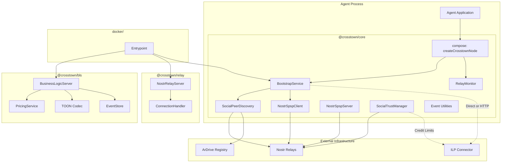
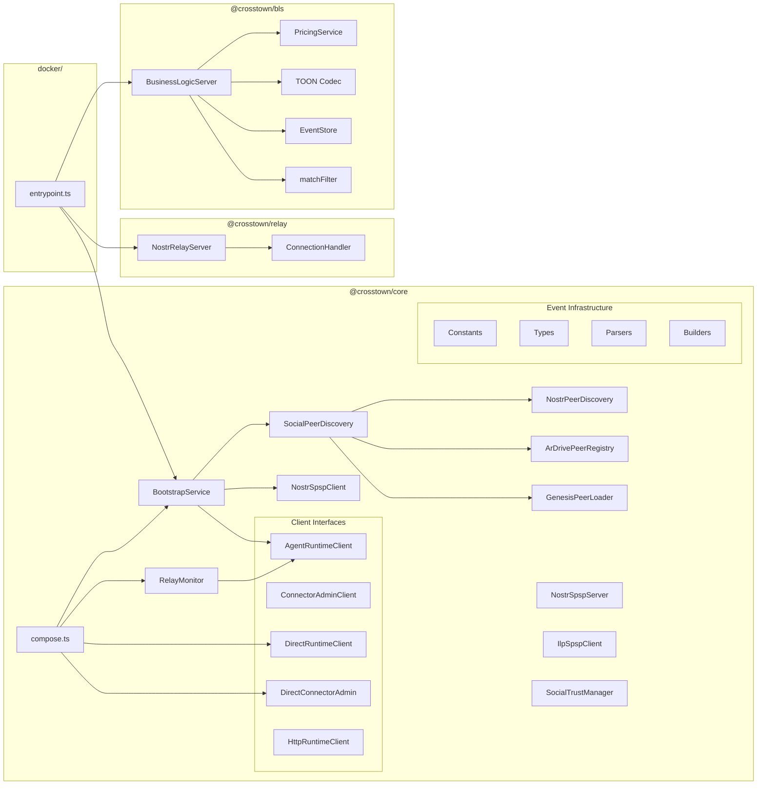
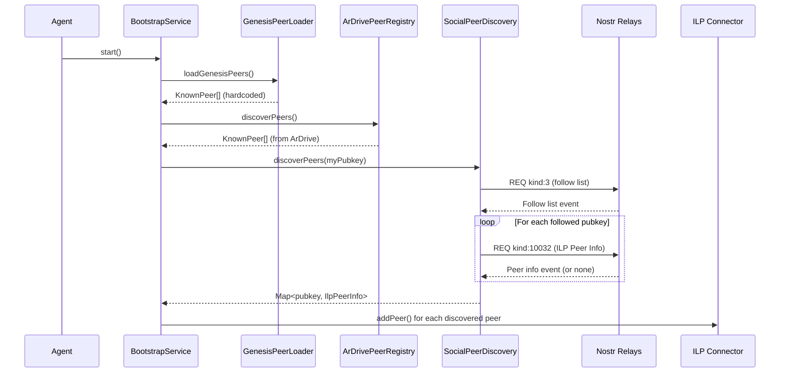
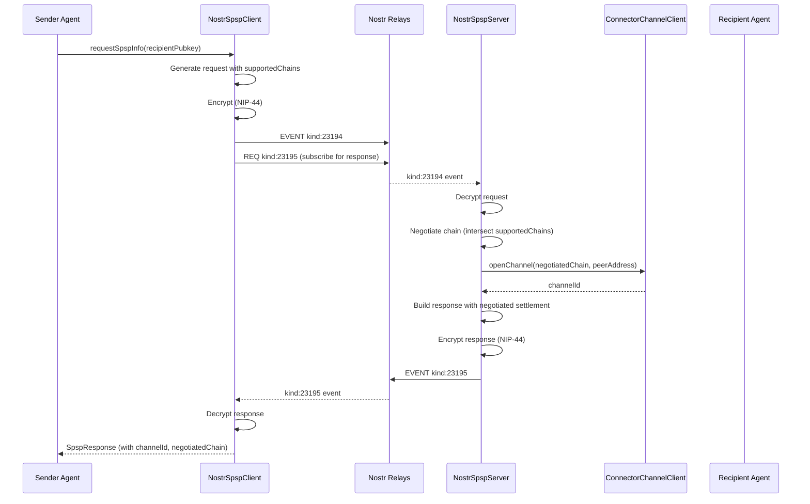
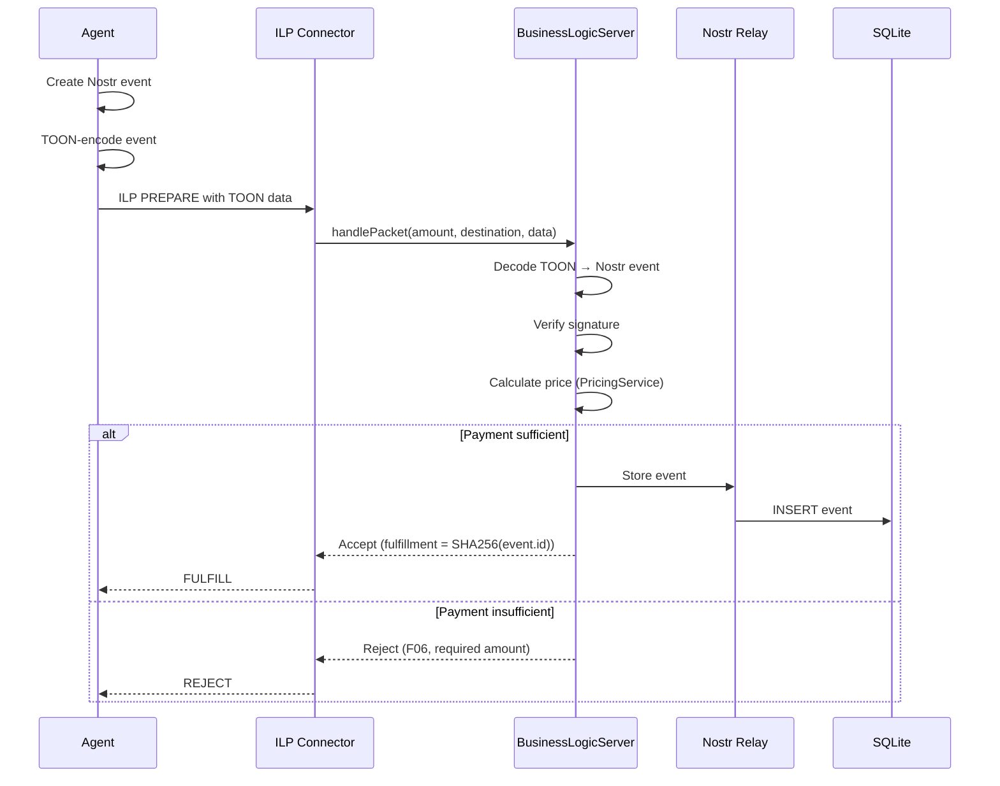
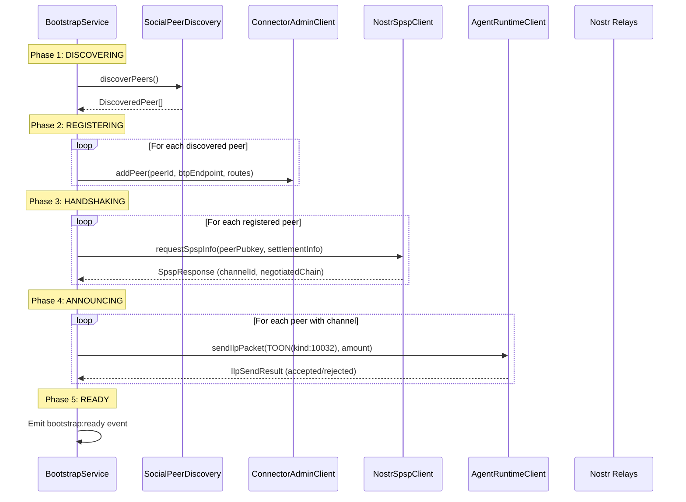
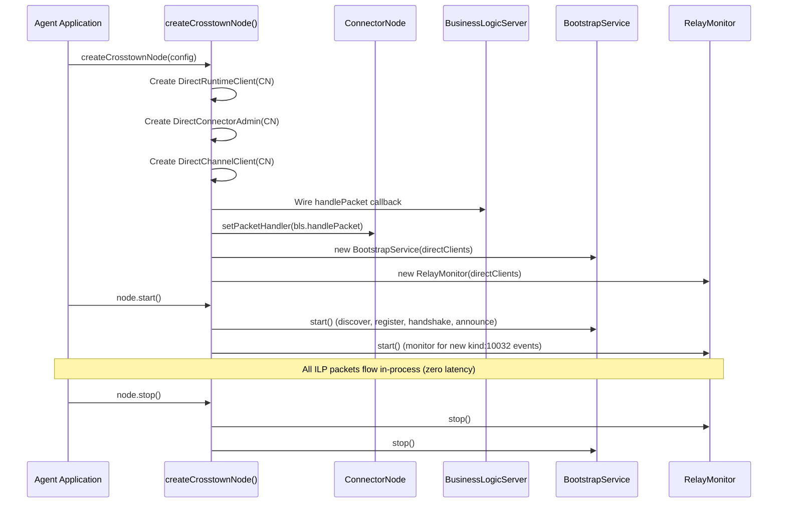

# Crosstown Protocol Architecture Document

## 1. Introduction

This document outlines the overall project architecture for **Crosstown Protocol**, including the core library packages, shared services, agent runtime, UI prototypes, and integration patterns. Its primary goal is to serve as the guiding architectural blueprint for AI-driven development, ensuring consistency and adherence to chosen patterns and technologies.

**Relationship to Frontend Architecture:**
The `ui-prototypes` package contains React-based UI prototypes for visualizing the agent network. These are design exploration tools, not production frontend code. No separate Frontend Architecture Document is required.

### 1.1 Starter Template or Existing Project

**Decision:** No starter template. This is a greenfield TypeScript monorepo using standard pnpm/TypeScript tooling configured manually.

**Rationale:** Specialized protocol library with unique Nostr + ILP requirements. Manual setup provides complete control over tooling without removing unnecessary boilerplate. The project has grown from a 3-package library to a 5-package monorepo with Docker deployment and an autonomous agent runtime.

### 1.2 Change Log

| Date | Version | Description | Author |
|------|---------|-------------|--------|
| 2026-02-05 | 0.1 | Initial architecture document | Architect |
| 2026-02-17 | 0.2 | Major update: BLS package extraction, bootstrap/compose modules, embedded connector, agent runtime, settlement negotiation, layered peer discovery, ui-prototypes, Docker entrypoint, NIP adoption roadmap (Epics 12-17), tech stack version updates | Architect |

---

## 2. High Level Architecture

### 2.1 Technical Summary

Crosstown Protocol is a **TypeScript monorepo** with a **modular package architecture**. The system consists of five packages plus a Docker entrypoint that enable autonomous agents to discover ILP payment peers via Nostr social graphs, exchange SPSP parameters with settlement negotiation over Nostr events, compute trust-based credit limits from social relationships, and run as autonomous LLM-powered agents that process Nostr events in real-time.

The architecture separates concerns across three layers:
1. **Discovery & Configuration** — Nostr handles peer discovery, SPSP exchange, and social graph traversal
2. **Payment Routing** — ILP connectors handle actual packet routing, settlement, and payment channels
3. **Autonomous Decision-Making** — LLM-powered handlers process Nostr events and execute structured actions (planned, Epic 11)

The library acts as a bridge — populating ILP connector routing tables from Nostr social graph data. In embedded mode (`createCrosstownNode()`), the connector runs in-process with zero-latency function calls.

### 2.2 High Level Overview

1. **Architectural Style:** Library/SDK with modular package structure + autonomous agent runtime
2. **Repository Structure:** Monorepo with `@crosstown/core`, `@crosstown/bls`, `@crosstown/relay`, `@crosstown/examples`, `@crosstown/ui-prototypes`, plus `docker/` entrypoint
3. **Service Architecture:** Library consumed by agents, with optional embedded connector mode and standalone Docker deployment
4. **Integration Patterns:**
   - **Embedded Mode:** `createCrosstownNode()` wires ConnectorNode + BLS + Bootstrap + RelayMonitor in-process (zero-latency)
   - **HTTP Mode:** Library in agent process communicates with connector via Admin API (separate processes)
   - **Docker Mode:** Standalone container running BLS + relay + bootstrap as a service

### 2.3 High Level Project Diagram



### 2.4 Architectural and Design Patterns

| Pattern | Application | Rationale |
|---------|-------------|-----------|
| **Modular Monorepo** | Package organization (core, bls, relay, examples, ui-prototypes) | Simplifies dependency management; enables atomic changes across packages |
| **Event-Driven Architecture** | Nostr pub/sub for discovery, SPSP, and real-time monitoring | Natural fit for Nostr; enables real-time updates via RelayMonitor |
| **Composition Pattern** | `createCrosstownNode()` wires all components with start/stop lifecycle | Single entry point for embedded mode; avoids manual component wiring |
| **Interface Abstraction** | `AgentRuntimeClient` / `ConnectorAdminClient` with HTTP and direct implementations | Swap between embedded and HTTP mode without changing consumer code |
| **Layered Peer Discovery** | Genesis peers → ArDrive registry → NIP-02 social graph | Progressive fallback ensures bootstrap works even with minimal network |
| **Strategy Pattern** | Configurable trust calculation weights | Agents can tune trust weights without code changes |
| **Builder Pattern** | Event builder utilities for all Nostr event kinds | Ensures correct event structure, tagging, and signing |
| **Deterministic Event Routing** | Kind number → handler dispatch (not LLM classification) | Predictable, testable routing; LLM decides actions within handlers |
| **Business Logic Server (BLS)** | Payment verification and TOON-encoded event processing | Standard ILP integration pattern; extracted as reusable package |
| **State Machine** | Bootstrap phases: discovering → registering → handshaking → announcing → ready | Clear lifecycle with event-driven phase transitions |

---

## 3. Tech Stack

### 3.1 Cloud Infrastructure

- **Provider:** N/A (Library - runs in consumer's environment)
- **Container Runtime:** Docker (optional, for standalone BLS+relay deployment)
- **Key Services:** None required; library is infrastructure-agnostic
- **Deployment Regions:** Consumer-determined

### 3.2 Technology Stack Table

| Category | Technology | Version | Purpose | Rationale |
|----------|------------|---------|---------|-----------|
| **Language** | TypeScript | ^5.3.x | Primary development language | PRD requirement; strong typing for complex protocol work |
| **Runtime** | Node.js | 24.x | Primary runtime | LTS stability; ESM support; PRD requirement (18+) |
| **Runtime** | Modern Browsers | ESM | Secondary runtime (ui-prototypes) | PRD requirement for browser compatibility |
| **Nostr Library** | nostr-tools | ^2.20.x | Nostr protocol operations | PRD requirement; official reference implementation |
| **Encryption** | @noble/ciphers | 0.5.x | NIP-44 encryption | Used by nostr-tools for encrypted DMs/SPSP |
| **TOON Encoding** | @toon-format/toon | 1.x | Encode Nostr events for ILP packet data | Standard format for embedding events in ILP PREPARE/FULFILL |
| **Database** | better-sqlite3 | ^11.x | BLS/relay event storage | Synchronous API; excellent performance; single-file |
| **WebSocket** | ws | 8.x | Relay WebSocket server | Standard Node.js WebSocket library |
| **HTTP Server** | Hono | ^4.x | BLS HTTP endpoints | Lightweight; TypeScript-first; works everywhere |
| **Build Tool** | tsup | 8.x | Library bundling | ESM/CJS dual output; minimal config |
| **Package Manager** | pnpm | >=8 | Monorepo management | Efficient disk usage; workspace support |
| **Test Framework** | Vitest | ^1.x | Unit and integration testing | Fast; native ESM; PRD requirement |
| **Linting** | ESLint | ^9.x | Code quality | Flat config; TypeScript support; ecosystem standard |
| **Formatting** | Prettier | ^3.2.x | Code formatting | Consistent style; zero-config |
| **Container** | Docker | - | Standalone BLS+relay deployment | Reproducible builds; production deployment |
| **UI Framework** | React | 19.x | UI prototypes | Component model for agent network visualization |
| **UI Build** | Vite | 7.x | UI prototype dev server and build | Fast HMR; native ESM |
| **UI Styling** | Tailwind CSS | v4 | UI prototype styling | Utility-first; rapid prototyping |
| **UI Components** | shadcn/ui + Radix | - | UI prototype components | Accessible, composable component primitives |
| **AI SDK** | Vercel AI SDK | v6.x | LLM integration for agent runtime (planned) | Multi-model support; structured output via Zod; lightweight |

---

## 4. Data Models

### 4.1 IlpPeerInfo

**Purpose:** Represents ILP connection information published by a peer via kind:10032 events.

**Key Attributes:**
- `ilpAddress`: string - ILP address of the peer's connector
- `btpEndpoint`: string - BTP WebSocket endpoint URL
- `settlementEngine`: string | undefined - *(deprecated)* Use supportedChains instead
- `assetCode`: string - Asset code (e.g., "USD", "XRP")
- `assetScale`: number - Asset scale (decimal places)
- `supportedChains`: string[] | undefined - Settlement chain identifiers (e.g., `["evm:base:8453", "xrp:mainnet"]`)
- `settlementAddresses`: Record<string, string> | undefined - Maps chain to settlement address
- `preferredTokens`: Record<string, string> | undefined - Maps chain to token contract address
- `tokenNetworks`: Record<string, string> | undefined - Maps chain to TokenNetwork contract (EVM)

**Relationships:**
- Associated with a Nostr pubkey (event author)
- Used by SocialPeerDiscovery to populate connector peer list
- Settlement fields used during SPSP negotiation (Epic 7)

### 4.2 SpspInfo

**Purpose:** SPSP parameters for payment setup, exchanged via kind:23195 (dynamic response).

**Key Attributes:**
- `destinationAccount`: string - ILP address to send payment to
- `sharedSecret`: string - Base64-encoded shared secret for STREAM

**Relationships:**
- Associated with a Nostr pubkey
- Used by NostrSpspClient/Server for payment setup

### 4.3 SpspRequest

**Purpose:** Request for fresh SPSP parameters with settlement negotiation, sent as kind:23194 ephemeral event.

**Key Attributes:**
- `requestId`: string - Unique request identifier
- `timestamp`: number - Request timestamp
- `ilpAddress`: string | undefined - Requester's ILP address
- `supportedChains`: string[] | undefined - Chains the requester supports
- `settlementAddresses`: Record<string, string> | undefined - Requester's settlement addresses per chain
- `preferredTokens`: Record<string, string> | undefined - Requester's preferred tokens per chain

**Relationships:**
- Sent to a specific recipient pubkey
- Triggers SpspResponse from recipient
- Encrypted with NIP-44

### 4.4 SpspResponse

**Purpose:** Response containing SPSP parameters with negotiated settlement details, sent as kind:23195 ephemeral event.

**Key Attributes:**
- `requestId`: string - Matching request identifier
- `destinationAccount`: string - ILP address
- `sharedSecret`: string - Base64-encoded shared secret
- `negotiatedChain`: string | undefined - Agreed settlement chain
- `settlementAddress`: string | undefined - Responder's settlement address
- `tokenAddress`: string | undefined - Token contract on negotiated chain
- `tokenNetworkAddress`: string | undefined - TokenNetwork contract (EVM)
- `channelId`: string | undefined - Payment channel ID if opened
- `settlementTimeout`: number | undefined - Challenge period in seconds

**Relationships:**
- Response to SpspRequest
- Encrypted with NIP-44 for recipient

### 4.5 TrustScore

**Purpose:** Computed trust assessment between two pubkeys.

**Key Attributes:**
- `score`: number - Overall trust score (0-1)
- `socialDistance`: number - Hops in follow graph
- `mutualFollowerCount`: number - Shared followers
- `breakdown`: TrustBreakdown - Component score details (socialDistanceScore, mutualFollowersScore, reputationScore)

**Relationships:**
- Computed from social graph data
- Used to derive credit limits via CreditLimitConfig
- Future: expanded with zapVolume, zapDiversity, settlementReliability, qualityLabelScore, badgeScore (Epics 14-15)

### 4.6 HandlePacketRequest / HandlePacketResponse

**Purpose:** ILP packet handling types for BLS communication with the connector.

**HandlePacketRequest:**
- `amount`: string - Payment amount (parsed to bigint)
- `destination`: string - ILP destination address
- `data`: string - Base64-encoded TOON Nostr event
- `sourceAccount`: string | undefined - Source ILP address

**HandlePacketAcceptResponse:**
- `accept`: true
- `fulfillment`: string - Base64-encoded SHA-256 fulfillment
- `metadata`: { eventId, storedAt } | undefined

**HandlePacketRejectResponse:**
- `accept`: false
- `code`: string - ILP error code (F00, F06, T00)
- `message`: string - Human-readable error
- `metadata`: { required, received } | undefined

### 4.7 Bootstrap Types

**Key Interfaces:**
- `BootstrapConfig` - Known peers, query timeout, ArDrive settings
- `BootstrapServiceConfig` - Extends BootstrapConfig with agent-runtime URL, settlement info, TOON codec DI callbacks
- `DiscoveredPeer` - Peer found via kind:10032 (pubkey, peerId, peerInfo, discoveredAt)
- `KnownPeer` - Genesis peer configuration (pubkey, relayUrl, btpEndpoint)
- `BootstrapResult` - Successful bootstrap result (knownPeer, peerInfo, registeredPeerId, channelId, negotiatedChain)
- `BootstrapPhase` - State machine: `'discovering' | 'registering' | 'handshaking' | 'announcing' | 'ready' | 'failed'`
- `BootstrapEvent` - Discriminated union of lifecycle events (phase changes, peer registration, channel opens, announcements)

### 4.8 Client Interfaces

**AgentRuntimeClient:**
- `sendIlpPacket(params): Promise<IlpSendResult>` - Send ILP packets (HTTP or direct)

**ConnectorAdminClient:**
- `addPeer(config): Promise<void>` - Register peer with connector (supports routes with priority, settlement config)
- `removePeer?(peerId): Promise<void>` - Optional peer removal

**ConnectorChannelClient:**
- `openChannel(params): Promise<OpenChannelResult>` - Open payment channel
- `getChannelState(channelId): Promise<ChannelState>` - Query channel state

### 4.9 Settlement Types

**Key Interfaces:**
- `SettlementNegotiationConfig` - Own chains, addresses, tokens, deposit amount, timeouts
- `SettlementNegotiationResult` - Negotiated chain, addresses, channel ID
- `OpenChannelParams` - Peer ID, chain, token, peer address, deposit
- `OpenChannelResult` - Channel ID and status
- `ChannelState` - Channel ID, status (`opening | open | closed | settled`), chain

### 4.10 NostrEvent (External)

**Purpose:** Standard Nostr event structure from nostr-tools.

**Key Attributes:**
- `id`: string - Event hash
- `pubkey`: string - Author public key
- `kind`: number - Event kind
- `content`: string - Event content
- `tags`: string[][] - Event tags
- `created_at`: number - Unix timestamp
- `sig`: string - Schnorr signature

---

## 5. Components

### 5.1 @crosstown/core

**Responsibility:** Main protocol library providing peer discovery, SPSP exchange, trust calculation, bootstrap orchestration, and embedded connector composition.

**Key Modules:**
- `bootstrap/` - BootstrapService (multi-phase lifecycle), RelayMonitor (real-time kind:10032 monitoring), AgentRuntimeClient/ConnectorAdminClient interfaces, direct and HTTP client implementations
- `discovery/` - SocialPeerDiscovery (layered: genesis → ArDrive → NIP-02), NostrPeerDiscovery, ArDrivePeerRegistry, GenesisPeerLoader
- `spsp/` - NostrSpspClient, NostrSpspServer, IlpSpspClient (ILP-first SPSP), settlement negotiation, channel opening
- `trust/` - SocialTrustManager, creditLimit mapping
- `events/` - Parsers, builders, constants for all event kinds
- `compose.ts` - `createCrosstownNode()` composition function

**Dependencies:** nostr-tools

### 5.2 @crosstown/bls

**Responsibility:** Standalone Business Logic Server for ILP payment verification, TOON decoding, event pricing, and storage. Extracted from relay as a reusable package for both relay and Docker deployments.

**Key Modules:**
- `bls/` - BusinessLogicServer (handlePacket), types (HandlePacketRequest/Response)
- `pricing/` - PricingService (per-kind pricing), config loading (env vars, file-based)
- `storage/` - EventStore interface, InMemoryEventStore, SqliteEventStore
- `filters/` - NIP-01 filter matching (matchFilter)
- `toon/` - TOON encoder/decoder for Nostr event ↔ ILP packet data

**Dependencies:** better-sqlite3, Hono, @toon-format/toon

### 5.3 @crosstown/relay

**Responsibility:** Reference implementation of ILP-gated Nostr relay with NIP-01 WebSocket server.

**Key Modules:**
- `websocket/` - NostrRelayServer, ConnectionHandler (NIP-01 REQ/EVENT/CLOSE)
- `bls/` - BusinessLogicServer (relay-specific BLS wrapping)
- `pricing/` - PricingService (relay pricing config)
- `storage/` - InMemoryEventStore, SqliteEventStore
- `toon/` - TOON encoder/decoder
- `filters/` - NIP-01 filter matching

**Dependencies:** ws, better-sqlite3, Hono

### 5.4 @crosstown/examples

**Responsibility:** Integration examples demonstrating library usage.

**Key Interfaces:**
- `ilp-gated-relay-demo/` - Full relay demo with agent, relay, and mock connector

**Dependencies:** @crosstown/core, @crosstown/bls

### 5.5 @crosstown/ui-prototypes

**Responsibility:** React-based UI prototypes for visualizing the agent network. Design exploration, not production code.

**Key Structure:**
- 9 prototypes in 3 categories: Observatory (network visualization), Colony (management), Nostr Client (social)
- Shared components in `src/components/shared/`
- Mock data layer with 12 agents, follow graph, trust scores, event feeds

**Dependencies:** React 19, Vite 7, Tailwind CSS v4, shadcn/ui, Radix UI

### 5.6 docker/

**Responsibility:** Standalone Docker entrypoint that wires BLS + relay + bootstrap into a deployable container.

**Key Files:**
- `src/entrypoint.ts` - Main entrypoint: config loading, BLS server start, SPSP server start, bootstrap orchestration
- `Dockerfile` - Container build

**Dependencies:** @crosstown/core, @crosstown/bls, @crosstown/relay

### 5.7 packages/agent/ (Planned — Epic 11)

**Responsibility:** Autonomous TypeScript runtime using Vercel AI SDK (v6) that subscribes to Nostr relays, routes events by kind to LLM-powered handlers, and executes structured actions back to relays.

**Planned Modules:**
- Kind Registry + Handler Loader (markdown handler references → system prompts)
- Zod action schemas with per-kind allowlists
- Core handler function (`handleNostrEvent()`) with structured output
- Action Executor (action JSON → relay publish)
- Security defense stack (content isolation, datamarkers, rate limiting, audit log)
- Multi-model provider registry (Anthropic, OpenAI, Ollama)

**Planned Dependencies:** ai (Vercel AI SDK v6), @ai-sdk/anthropic, zod, nostr-tools

### 5.8 Component Diagram



---

## 6. External APIs

### 6.1 Nostr Relays

- **Purpose:** Event storage and retrieval; pub/sub for real-time updates
- **Documentation:** https://github.com/nostr-protocol/nips
- **Base URL(s):** Consumer-configured (e.g., wss://relay.damus.io)
- **Authentication:** Signed events (NIP-01)
- **Rate Limits:** Relay-dependent

**Key Operations Used:**
- `REQ` - Subscribe to events matching filters
- `EVENT` - Publish signed events
- `CLOSE` - Close subscriptions

**Event Kinds Used:**

| Kind | Name | Usage |
|------|------|-------|
| 3 | Follow List (NIP-02) | Peer discovery via social graph |
| 10032 | ILP Peer Info | Connector address, BTP endpoint, settlement chains |
| 23194 | SPSP Request | Encrypted request for SPSP parameters + settlement negotiation |
| 23195 | SPSP Response | Encrypted response with SPSP params + negotiated settlement |

**Integration Notes:** Library uses nostr-tools SimplePool for relay management. All tests mock SimplePool to avoid live relay dependency. RelayMonitor provides real-time subscription to kind:10032 events for dynamic peer discovery.

### 6.2 agent-runtime Connector

- **Purpose:** ILP connector for packet routing, peer management, and payment channels
- **Documentation:** https://github.com/anthropics/agent-runtime

**Integration Modes:**

| Mode | Transport | Latency | Configuration |
|------|-----------|---------|---------------|
| **Embedded** | In-process function calls | Zero | `createCrosstownNode()` with ConnectorNode |
| **HTTP** | REST API | Network | `createHttpRuntimeClient(baseUrl)` |

**Key API Surfaces (both modes):**

| Operation | HTTP Endpoint | Direct Method |
|-----------|---------------|---------------|
| Send ILP packet | `POST /ilp/send` | `connector.sendPacket()` |
| Add peer | `POST /admin/peers` | `connector.registerPeer()` |
| Remove peer | `DELETE /admin/peers/:id` | `connector.removePeer()` |
| Handle incoming packet | `POST /handle-packet` | `bls.handlePacket()` (public) |
| Open payment channel | `POST /admin/channels` | `connector.openChannel()` |
| Get channel state | `GET /admin/channels/:id` | `connector.getChannelState()` |

**Integration Notes:** `@agent-runtime/connector` is an optional peer dependency. HTTP-only mode works without it. Both HTTP and direct clients implement the same `AgentRuntimeClient` / `ConnectorAdminClient` interfaces.

### 6.3 ArDrive Peer Registry

- **Purpose:** Decentralized peer registry for bootstrap when NIP-02 social graph is empty
- **Base URL(s):** ArDrive transaction queries
- **Authentication:** None (public read)

**Integration Notes:** ArDrivePeerRegistry provides fallback peer discovery. Genesis peers → ArDrive → NIP-02 forms the layered discovery stack.

---

## 7. Core Workflows

### 7.1 Layered Peer Discovery Flow



### 7.2 SPSP Handshake with Settlement Negotiation



### 7.3 ILP-Gated Relay Write Flow



### 7.4 Network Bootstrap Flow



### 7.5 Embedded Connector Composition



---

## 8. Database Schema

The BLS and relay packages use SQLite for event persistence. Schema follows NIP-01 event structure.

```sql
-- Events table
CREATE TABLE events (
    id TEXT PRIMARY KEY,           -- Event ID (hash)
    pubkey TEXT NOT NULL,          -- Author public key
    kind INTEGER NOT NULL,         -- Event kind
    content TEXT NOT NULL,         -- Event content
    tags TEXT NOT NULL,            -- JSON-encoded tags array
    created_at INTEGER NOT NULL,   -- Unix timestamp
    sig TEXT NOT NULL,             -- Schnorr signature
    received_at INTEGER NOT NULL   -- When relay received event
);

-- Indexes for common queries
CREATE INDEX idx_events_pubkey ON events(pubkey);
CREATE INDEX idx_events_kind ON events(kind);
CREATE INDEX idx_events_created_at ON events(created_at);
CREATE INDEX idx_events_pubkey_kind ON events(pubkey, kind);

-- For replaceable events (kinds 10000-19999)
-- Application logic handles replacement on insert
```

**Design Notes:**
- Tags stored as JSON for flexibility
- `received_at` tracks when relay received event (for debugging/auditing)
- Replaceable events handled in application layer (delete old, insert new)
- No foreign keys; events are self-contained
- InMemoryEventStore available for testing (same interface)

---

## 9. Source Tree

```
crosstown/
├── packages/
│   ├── core/                              # @crosstown/core
│   │   ├── src/
│   │   │   ├── index.ts                  # Package exports
│   │   │   ├── constants.ts              # Event kind constants (10032, 23194, 23195)
│   │   │   ├── types.ts                  # Core TypeScript interfaces
│   │   │   ├── errors.ts                 # CrosstownError hierarchy
│   │   │   ├── compose.ts               # createCrosstownNode()
│   │   │   ├── bootstrap/
│   │   │   │   ├── index.ts
│   │   │   │   ├── types.ts             # Bootstrap types, client interfaces
│   │   │   │   ├── BootstrapService.ts   # Multi-phase bootstrap orchestration
│   │   │   │   ├── RelayMonitor.ts       # Real-time kind:10032 monitoring
│   │   │   │   ├── agent-runtime-client.ts  # HTTP AgentRuntimeClient
│   │   │   │   ├── direct-runtime-client.ts # In-process AgentRuntimeClient
│   │   │   │   ├── direct-connector-admin.ts # In-process ConnectorAdminClient
│   │   │   │   └── direct-channel-client.ts  # In-process ConnectorChannelClient
│   │   │   ├── discovery/
│   │   │   │   ├── index.ts
│   │   │   │   ├── SocialPeerDiscovery.ts   # Layered: genesis → ArDrive → NIP-02
│   │   │   │   ├── NostrPeerDiscovery.ts    # NIP-02 follow list discovery
│   │   │   │   ├── ArDrivePeerRegistry.ts   # ArDrive peer lookup
│   │   │   │   ├── GenesisPeerLoader.ts     # Hardcoded genesis peers
│   │   │   │   └── genesis-peers.json       # Genesis peer configuration
│   │   │   ├── spsp/
│   │   │   │   ├── index.ts
│   │   │   │   ├── NostrSpspClient.ts       # SPSP request over Nostr
│   │   │   │   ├── NostrSpspServer.ts       # SPSP response + settlement negotiation
│   │   │   │   ├── IlpSpspClient.ts         # ILP-first SPSP (PREPARE/FULFILL)
│   │   │   │   ├── settlement.ts            # Settlement chain negotiation logic
│   │   │   │   └── negotiateAndOpenChannel.ts # Channel opening during handshake
│   │   │   ├── trust/
│   │   │   │   ├── index.ts
│   │   │   │   ├── SocialTrustManager.ts
│   │   │   │   └── creditLimit.ts           # Trust score → credit limit mapping
│   │   │   ├── events/
│   │   │   │   ├── index.ts
│   │   │   │   ├── parsers.ts               # Event kind parsers
│   │   │   │   └── builders.ts              # Event kind builders
│   │   │   └── __integration__/
│   │   │       └── five-peer-bootstrap.test.ts
│   │   ├── package.json
│   │   ├── tsconfig.json
│   │   └── tsup.config.ts
│   │
│   ├── bls/                               # @crosstown/bls
│   │   ├── src/
│   │   │   ├── index.ts
│   │   │   ├── errors.ts                 # BlsBaseError, ConfigError
│   │   │   ├── config.ts                 # Environment config loading
│   │   │   ├── entrypoint.ts             # BLS server entrypoint
│   │   │   ├── server.ts                 # Hono HTTP server
│   │   │   ├── bls/
│   │   │   │   ├── index.ts
│   │   │   │   ├── types.ts             # HandlePacketRequest/Response, BlsConfig
│   │   │   │   └── BusinessLogicServer.ts # Core BLS (handlePacket, TOON, pricing)
│   │   │   ├── pricing/
│   │   │   │   ├── index.ts
│   │   │   │   ├── types.ts             # PricingConfig, PricingError
│   │   │   │   ├── PricingService.ts    # Per-kind event pricing
│   │   │   │   └── config.ts            # Pricing config loading
│   │   │   ├── storage/
│   │   │   │   ├── index.ts
│   │   │   │   ├── EventStore.ts        # EventStore interface
│   │   │   │   ├── InMemoryEventStore.ts
│   │   │   │   ├── SqliteEventStore.ts
│   │   │   │   └── createEventStore.ts  # Factory function
│   │   │   ├── filters/
│   │   │   │   ├── index.ts
│   │   │   │   └── matchFilter.ts       # NIP-01 filter matching
│   │   │   └── toon/
│   │   │       ├── index.ts
│   │   │       ├── encoder.ts           # Nostr event → TOON bytes
│   │   │       └── decoder.ts           # TOON bytes → Nostr event
│   │   ├── package.json
│   │   ├── tsconfig.json
│   │   └── tsup.config.ts
│   │
│   ├── relay/                             # @crosstown/relay
│   │   ├── src/
│   │   │   ├── index.ts
│   │   │   ├── types.ts
│   │   │   ├── websocket/
│   │   │   │   ├── index.ts
│   │   │   │   ├── NostrRelayServer.ts   # NIP-01 WebSocket server
│   │   │   │   └── ConnectionHandler.ts  # Per-connection NIP-01 handler
│   │   │   ├── bls/                      # Relay-specific BLS wrapper
│   │   │   ├── pricing/                  # Relay pricing config
│   │   │   ├── storage/                  # InMemoryEventStore, SqliteEventStore
│   │   │   ├── filters/                  # NIP-01 filter matching
│   │   │   └── toon/                     # TOON encoder/decoder
│   │   ├── package.json
│   │   ├── tsconfig.json
│   │   └── tsup.config.ts
│   │
│   ├── examples/                          # @crosstown/examples
│   │   ├── src/
│   │   │   ├── index.ts
│   │   │   └── ilp-gated-relay-demo/
│   │   │       ├── agent.ts
│   │   │       ├── relay.ts
│   │   │       ├── mock-connector.ts
│   │   │       └── README.md
│   │   ├── package.json
│   │   └── tsconfig.json
│   │
│   └── ui-prototypes/                     # @crosstown/ui-prototypes
│       ├── src/
│       │   ├── App.tsx                   # Router for prototype pages
│       │   ├── main.tsx                  # React entry point
│       │   ├── components/
│       │   │   ├── shared/              # Reusable components
│       │   │   └── ui/                  # shadcn/ui components
│       │   ├── data/
│       │   │   ├── mock-agents.ts       # 12 mock agents with trust/ILP data
│       │   │   └── mock-social.ts       # Follow graph, events, feeds
│       │   └── prototypes/
│       │       ├── observatory/         # Network visualization prototypes
│       │       ├── colony/              # Management prototypes
│       │       └── nostr-client/        # Social client prototypes
│       ├── index.html
│       ├── package.json
│       ├── tsconfig.json
│       └── vite.config.ts
│
├── docker/                                # Docker entrypoint
│   ├── src/
│   │   ├── entrypoint.ts                # BLS + relay + bootstrap wiring
│   │   └── entrypoint.test.ts
│   ├── Dockerfile
│   ├── package.json
│   ├── tsconfig.json
│   └── vitest.config.ts
│
├── docs/
│   ├── architecture.md                    # This document
│   ├── architecture/                     # Sharded architecture sections
│   ├── prd.md                            # Product requirements
│   ├── prd/                              # Sharded PRD sections
│   ├── epics/                            # Epic definitions (1-17)
│   ├── stories/                          # Story files (1.x-10.x)
│   ├── research/                         # Research reports
│   └── qa/                               # QA gate files
│
├── .github/
│   └── workflows/
│       └── ci.yml                        # CI pipeline
│
├── package.json                           # Root package.json (workspaces)
├── pnpm-workspace.yaml                   # pnpm workspace config
├── tsconfig.json                         # Root TypeScript config
├── vitest.config.ts                      # Unit test configuration
├── vitest.integration.config.ts          # Integration test configuration
├── eslint.config.js                      # ESLint flat configuration
└── prettier.config.js                    # Prettier configuration
```

---

## 10. Infrastructure and Deployment

### 10.1 Infrastructure as Code

- **Tool:** Docker for containerized deployment
- **Location:** `docker/Dockerfile`
- **Approach:** Library packages published to npm; Docker image for standalone relay+BLS deployment

### 10.2 Deployment Strategy

- **Strategy:** Dual deployment — npm packages + Docker images
- **CI/CD Platform:** GitHub Actions
- **Pipeline Configuration:** `.github/workflows/ci.yml`

**npm Publishing Flow:**
1. Version bump in package.json files (coordinated across packages)
2. Create git tag
3. GitHub Actions builds and tests
4. Publish to npm registry (@crosstown/core, @crosstown/bls, @crosstown/relay)

**Docker Publishing Flow:**
1. Build from `docker/Dockerfile`
2. Image includes BLS + relay + bootstrap entrypoint
3. Configure via environment variables

### 10.3 Environments

- **Development:** Local development with mocked relays and in-memory stores
- **Integration Testing:** Five-peer bootstrap test with mocked connectors (`vitest.integration.config.ts`)
- **CI:** GitHub Actions runners with full test suite
- **npm Registry:** Published packages for consumers
- **Docker:** Standalone container deployment

### 10.4 Environment Promotion Flow

```
Local Dev → PR → main branch → Tagged Release → npm publish / Docker build
     ↓         ↓                     ↓                    ↓
  Unit Tests  CI Tests         Publish to npm       Push Docker image
  Integration                                       (manual trigger)
```

### 10.5 Rollback Strategy

- **npm:** npm unpublish (within 72 hours) or deprecate + new patch version
- **Docker:** Tag previous image version; roll back container
- **Trigger Conditions:** Critical bugs, security vulnerabilities, broken builds
- **Recovery Time Objective:** < 1 hour for npm deprecation + patch

---

## 11. Error Handling Strategy

### 11.1 General Approach

- **Error Model:** Custom error classes extending Error with error codes and cause chaining
- **Exception Hierarchies:** Separate hierarchies per package
- **Error Propagation:** Errors thrown from library; consumers handle

**Core Package (`@crosstown/core`):**
```typescript
class CrosstownError extends Error {
  constructor(message: string, public readonly code: string, cause?: Error) {
    super(message, { cause });
  }
}

class InvalidEventError extends CrosstownError {}      // INVALID_EVENT
class PeerDiscoveryError extends CrosstownError {}      // PEER_DISCOVERY_FAILED
class SpspError extends CrosstownError {}               // SPSP_FAILED
class SpspTimeoutError extends CrosstownError {}        // SPSP_TIMEOUT
class TrustCalculationError extends CrosstownError {}   // TRUST_CALCULATION_FAILED
```

**BLS Package (`@crosstown/bls`):**
```typescript
class BlsBaseError extends Error {
  constructor(message: string, public code: string) {}
}

class BlsError extends BlsBaseError {}        // BLS_ERROR
class ConfigError extends BlsBaseError {}     // CONFIG_ERROR
```

**ILP Error Codes (BLS):** `F00` (bad request), `F06` (insufficient amount), `T00` (internal error)

### 11.2 Logging Standards

- **Library (core):** No built-in logging; throws descriptive errors with context
- **BLS Package:** Uses console with structured output; consumers can replace
- **Docker Entrypoint:** Console logging with environment-configurable levels

### 11.3 Error Handling Patterns

#### External API Errors (Nostr Relays)

- **Retry Policy:** Query multiple relays; continue on individual failures
- **Circuit Breaker:** Not implemented; rely on relay redundancy
- **Timeout Configuration:** Configurable per operation (default 10s for SPSP, 5s for discovery)
- **Error Translation:** Relay errors wrapped in library error types

#### Business Logic Errors

- **Custom Exceptions:** `InvalidEventError`, `SpspTimeoutError`, `PeerDiscoveryError`, `BlsError`
- **Error Codes:** `INVALID_EVENT`, `SPSP_TIMEOUT`, `PEER_DISCOVERY_FAILED`, `BLS_ERROR`, `CONFIG_ERROR`
- **ILP Error Mapping:** BLS maps domain errors to ILP error codes (F00, F06, T00)

#### Bootstrap Errors

- **Event-Based:** Bootstrap emits typed events for phase failures (`bootstrap:handshake-failed`, `bootstrap:announce-failed`)
- **Partial Success:** Bootstrap continues with remaining peers if individual peers fail
- **Phase Rollback:** Failed phase transitions emit events; consumers decide retry strategy

#### Data Consistency

- **Transaction Strategy:** SQLite transactions for relay event storage
- **Compensation Logic:** N/A (single-operation writes)
- **Idempotency:** Events identified by hash; duplicate writes ignored

---

## 12. Coding Standards

### 12.1 Core Standards

- **Languages & Runtimes:** TypeScript ^5.3.x (strict mode), Node.js 24.x
- **Style & Linting:** ESLint 9.x (flat config) + Prettier 3.x (config in repo root)
- **Test Organization:** Co-located `*.test.ts` files next to source; integration tests in `__integration__/`

### 12.2 Naming Conventions

| Element | Convention | Example |
|---------|------------|---------|
| Files (source) | PascalCase for classes, kebab-case for utilities | `BusinessLogicServer.ts`, `credit-limit.ts` |
| Files (test) | Match source with `.test.ts` suffix | `BusinessLogicServer.test.ts` |
| Classes | PascalCase | `SocialPeerDiscovery` |
| Interfaces | PascalCase (no I- prefix by convention) | `IlpPeerInfo`, `HandlePacketRequest` |
| Functions | camelCase | `discoverPeers`, `createCrosstownNode` |
| Constants | UPPER_SNAKE_CASE | `ILP_PEER_INFO_KIND`, `SPSP_REQUEST_KIND` |
| Type aliases | PascalCase | `TrustScore`, `BootstrapPhase` |
| Event types | Discriminated unions with `type` field | `BootstrapEvent` |

### 12.3 Critical Rules

- **Never use `any`:** Use `unknown` and type guards instead
- **Always mock SimplePool in tests:** No live relay dependencies in CI
- **Export from index.ts:** All public APIs exported from package index
- **Use nostr-tools types:** Don't redefine Nostr event types
- **Validate event signatures:** Never trust unsigned/unverified events
- **Structural typing for cross-package interfaces:** Use `ConnectorNodeLike` instead of direct import to keep `@agent-runtime/connector` as optional peer dep
- **DI for cross-package codecs:** Pass TOON encoder/decoder as config callbacks to avoid circular dependencies

---

## 13. Test Strategy and Standards

### 13.1 Testing Philosophy

- **Approach:** Test-after with comprehensive coverage for public APIs
- **Coverage Goals:** >80% line coverage for core and BLS packages
- **Test Pyramid:** Unit-heavy; integration tests for bootstrap flows

### 13.2 Test Types and Organization

#### Unit Tests

- **Framework:** Vitest ^1.x
- **Config:** `vitest.config.ts` (root)
- **File Convention:** `*.test.ts` co-located with source
- **Location:** Same directory as source file
- **Mocking Library:** Vitest built-in mocking (`vi.fn()`, `vi.mock()`)
- **Coverage Requirement:** >80% for public APIs

**Requirements:**
- All public methods have unit tests
- Edge cases and error conditions covered
- SimplePool always mocked (never live relays)
- Follow AAA pattern (Arrange, Act, Assert)

#### Integration Tests

- **Config:** `vitest.integration.config.ts` (root)
- **Scope:** Multi-component bootstrap flows, five-peer bootstrap test
- **Location:** `packages/*/src/__integration__/`
- **Test Infrastructure:**
  - **Mocked Connectors:** In-memory connector simulation
  - **SQLite:** In-memory for unit tests, file-based for integration
  - **Nostr Relay:** Mocked SimplePool (no live relays)

#### E2E Tests

- **Not in current scope** — planned for post-Epic 11

### 13.3 Test Data Management

- **Strategy:** Factory functions for test fixtures
- **Fixtures:** In test files or `__fixtures__/` directories
- **Factories:** Helper functions creating valid test events with proper signatures
- **JSON Fixtures:** `genesis-peers.json`, `testnet-wallets.json`
- **Cleanup:** Vitest handles; in-memory stores reset per test

### 13.4 Continuous Testing

- **CI Integration:** GitHub Actions runs `pnpm test` on all PRs
- **Performance Tests:** Not in current scope
- **Security Tests:** npm audit in CI

---

## 14. Security

### 14.1 Input Validation

- **Validation Approach:** Regex validation + nostr-tools verification at boundaries
- **Validation Location:** At library boundaries (public API methods, BLS packet handler)
- **Required Rules:**
  - All pubkeys validated as 64-character lowercase hex (`/^[0-9a-f]{64}$/`)
  - All events verified with nostr-tools `verifyEvent()` before processing
  - ILP addresses validated against format
  - TOON-decoded events re-verified after decoding

### 14.2 Authentication & Authorization

- **Auth Method:** Nostr event signatures (Schnorr/secp256k1)
- **Session Management:** N/A (stateless library)
- **Required Patterns:**
  - Always verify event signatures before processing
  - Use NIP-44 encryption for SPSP request/response
  - BLS owner pubkey bypass for self-signed events

### 14.3 Secrets Management

- **Development:** Consumer provides keypairs; library never stores keys
- **Production:** Same as development; Docker entrypoint accepts keys via env vars
- **Code Requirements:**
  - NEVER log private keys or shared secrets
  - Private keys passed as parameters, never stored
  - Shared secrets handled as opaque blobs
  - Settlement addresses and channel IDs are not secret but should not be logged at debug level

### 14.4 API Security

- **Rate Limiting:** N/A for library; Docker deployment should add relay-level rate limiting
- **CORS Policy:** N/A (library; Docker BLS is internal-only)
- **Security Headers:** N/A (library)
- **HTTPS Enforcement:** Relay consumers should enforce WSS

### 14.5 Data Protection

- **Encryption at Rest:** Consumer responsibility (relay SQLite)
- **Encryption in Transit:** NIP-44 for SPSP; WSS for relay connections
- **PII Handling:** Pubkeys are pseudonymous; no PII collected
- **Logging Restrictions:** Never log private keys, shared secrets, or decrypted SPSP payloads

### 14.6 NIP Handler Security (Planned — Epic 11)

- **Content Isolation:** Untrusted event content wrapped with `<untrusted-content>` tags and `^` datamarkers before LLM processing
- **Allowlist Enforcement:** Per-kind action allowlists reject unauthorized actions
- **Rate Limiting:** Per-pubkey, per-kind rate limiting stored in SQLite
- **Audit Logging:** All LLM-decided actions logged with event ID, kind, pubkey, action, timestamp, token usage

### 14.7 Dependency Security

- **Scanning Tool:** npm audit, Dependabot
- **Update Policy:** Security patches within 48 hours
- **Approval Process:** Dependencies reviewed before adding
- **Optional Peer Deps:** `@agent-runtime/connector` is optional to minimize attack surface

### 14.8 Security Testing

- **SAST Tool:** ESLint security rules
- **DAST Tool:** Not applicable (library)
- **Penetration Testing:** Not in current scope

---

## 15. NIP Adoption Roadmap

The following epics extend the protocol with standardized Nostr Improvement Proposals (NIPs), building progressively from social identity to autonomous agent swarms.

### Phase 0: Social Fabric Foundation (Epic 12)

**NIPs:** NIP-05 (DNS Identity), NIP-25 (Reactions), NIP-65 (Relay List Metadata), NIP-09 (Event Deletion), NIP-56 (Reporting)

Establishes social identity, reputation signaling, and moderation primitives. Agents become first-class Nostr participants — discoverable by humans and machines, capable of expressing quality feedback, and protected from abuse.

**Key Architectural Additions:**
- `AgentProfileBuilder` — kind:0 profiles with NIP-05 identity
- `RelayListManager` — kind:10002 relay preferences for multi-relay discovery
- Reaction/report signals feed into SocialTrustManager as lightweight reputation inputs
- Relay event store extended with kind:5 deletion handling

### Phase 1: Paid Computation Marketplace (Epic 13)

**NIPs:** NIP-90 (Data Vending Machines), NIP-89 (Service Discovery)

Enables paid agent-to-agent computation via NIP-90 DVMs with ILP micropayments. Customer sends ILP PREPARE with TOON-encoded kind:5xxx job request; provider returns kind:6xxx result in FULFILL.

**Key Architectural Additions:**
- `DvmJobHandler` — BLS module for processing DVM job requests
- `DvmAnnouncementBuilder` — kind:31990 capability advertisements
- `DvmDiscovery` — Social-graph-weighted service provider discovery
- `DvmJobChain` — Multi-agent computation pipelines via sequential ILP payments

### Phase 2a: Trust Infrastructure — ILP Zaps (Epic 14)

**NIPs:** NIP-57 (Zaps, adapted for ILP), NIP-51 (Lists)

ILP-backed zaps with cryptographic proof-of-payment. Zap history, diversity, and settlement reliability feed into trust scores. NIP-51 lists enable explicit routing preferences.

**Key Architectural Additions:**
- ILP zap request (kind:9734) / receipt (kind:9735) event types
- `ZapHandler` in BLS for accepting zap payments and publishing receipts
- SocialTrustManager expanded: zapVolume, zapDiversity, settlementReliability
- Trust-weighted route priority in peer registration
- NIP-51 trusted-routes and mute lists for routing signals

### Phase 2b: Trust Infrastructure — Labels & Badges (Epic 15)

**NIPs:** NIP-32 (Labeling), NIP-58 (Badges)

Agent capability taxonomy via labels, post-service quality ratings, and verifiable badge credentials for settlement reliability and throughput milestones.

**Key Architectural Additions:**
- NIP-32 label namespaces: `agent-skill`, `agent-quality`, `agent-warning`, `agent-tier`
- `BadgeIssuer` — kind:30009 definitions, kind:8 awards, auto-issuance via metric thresholds
- Comprehensive multi-signal trust model (9 components)

### Phase 3: Communication & Content Layer (Epic 16)

**NIPs:** NIP-17 (Private DMs), NIP-10 (Threading), NIP-18 (Reposts), NIP-23 (Long-form Content), NIP-72 (Communities)

Full communication stack: metadata-private DMs, threaded discussions, content amplification, paid articles, and moderated agent communities.

**Key Architectural Additions:**
- `PrivateMessaging` — Three-layer NIP-17 encryption (rumor → seal → gift wrap)
- Threading utilities for multi-turn public discourse
- NIP-23 article authoring with ILP payment gating (already priced in BLS)
- `CommunityModerator` — Programmatic approval hooks for NIP-72 communities

### Phase 4: Advanced Patterns — Agent Swarms (Epic 17)

**NIPs:** NIP-29 (Relay-Based Groups)

Payment-gated agent swarms with ILP payment channel membership gating, hierarchical ILP address allocation, and TOON-encoded intra-swarm communication where every message is a micropayment.

**Key Architectural Additions:**
- `SwarmManager` — NIP-29 group lifecycle (create, join, dissolve)
- `MembershipValidator` — Payment channel deposit + badge + trust gating
- `SwarmAddressManager` — Hierarchical ILP address allocation (`g.swarm-<groupId>.<memberId>`)
- `SwarmMessenger` — TOON-encoded group events as ILP PREPARE packets

### Trust Score Evolution

The SocialTrustManager trust formula evolves across phases:

```
Phase 0 (current):  w1*socialDistance + w2*mutualFollowers + w3*reputationScore
Phase 1 (Epic 12):  + w4*reactionScore + w5*reportPenalty
Phase 2 (Epic 14):  + w6*zapVolume + w7*zapDiversity + w8*settlementReliability
Phase 3 (Epic 15):  + w9*qualityLabelScore + w10*badgeScore
```

---

## 16. Checklist Results Report

_(To be completed after running architect-checklist)_

---

## 17. Next Steps

### 17.1 Current State

- **Completed:** Epics 1-10 (Foundation, SPSP, Trust, Relay, Docker BLS, Peer Discovery, Settlement, Bootstrap, npm Publishing, Embedded Connector)
- **In Progress:** Epic 11 (NIP Handler Agent Runtime — `packages/agent/`)
- **Planned:** Epics 12-17 (NIP Adoption Roadmap)

### 17.2 Immediate Actions

1. Complete Epic 11: NIP Handler Agent Runtime (`packages/agent/`)
2. Begin Epic 12: Social Fabric Foundation (NIP-05, NIP-25, NIP-65, NIP-09, NIP-56)
3. Expand SocialTrustManager with reaction and report signals

### 17.3 Architecture Document Maintenance

This document is sharded into focused files for dev agent consumption:
- `docs/architecture/2-high-level-architecture.md` - Section 2
- `docs/architecture/3-tech-stack.md` - Section 3
- `docs/architecture/5-components.md` - Section 5
- `docs/architecture/9-source-tree.md` - Section 9
- `docs/architecture/12-coding-standards.md` - Section 12

The sharded files in `docs/architecture/` must be updated whenever the main `architecture.md` changes.

---

_Generated with BMAD Method_
