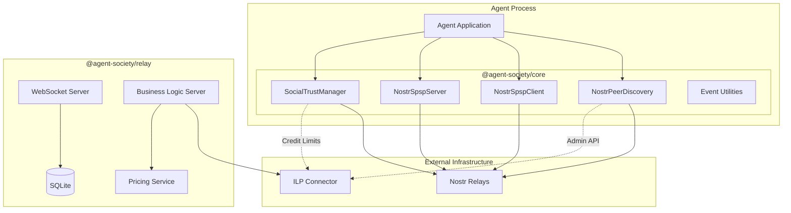
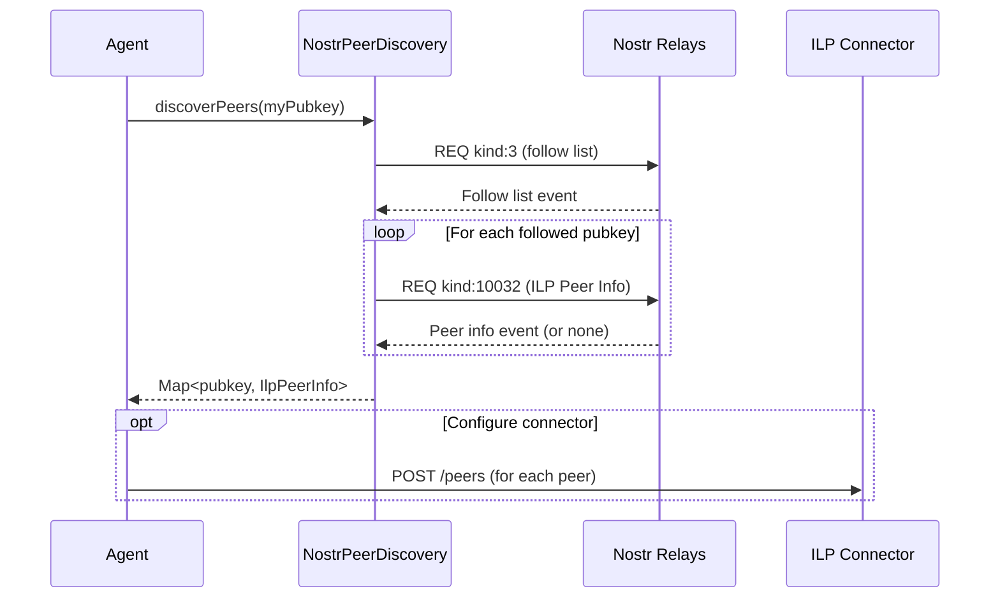
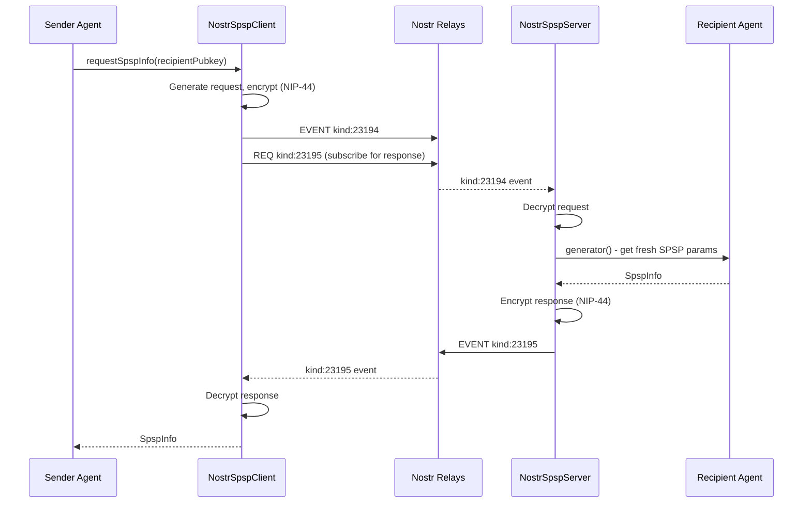
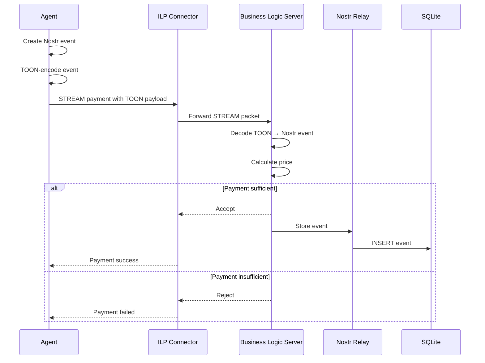

# Agent Society Protocol Architecture Document

## 1. Introduction

This document outlines the overall project architecture for **Agent Society Protocol**, including the core library packages, shared services, and integration patterns. Its primary goal is to serve as the guiding architectural blueprint for AI-driven development, ensuring consistency and adherence to chosen patterns and technologies.

**Relationship to Frontend Architecture:**
This project is a library with no user interface. No separate Frontend Architecture Document is required.

### 1.1 Starter Template or Existing Project

**Decision:** No starter template. This is a greenfield TypeScript library project using standard npm/TypeScript monorepo tooling configured manually.

**Rationale:** Specialized library with unique Nostr + ILP requirements. Manual setup provides complete control over tooling without removing unnecessary boilerplate.

### 1.2 Change Log

| Date | Version | Description | Author |
|------|---------|-------------|--------|
| 2026-02-05 | 0.1 | Initial architecture document | Architect |

---

## 2. High Level Architecture

### 2.1 Technical Summary

Agent Society Protocol is a **TypeScript library** following a **modular monorepo architecture**. The system consists of three packages that enable autonomous agents to discover ILP payment peers via Nostr social graphs, exchange SPSP parameters over Nostr events, and compute trust-based credit limits from social relationships.

The architecture separates concerns cleanly: Nostr handles discovery and configuration, while ILP connectors handle actual packet routing. The library acts as a bridge—populating ILP connector routing tables from Nostr social graph data rather than replacing ILP infrastructure.

### 2.2 High Level Overview

1. **Architectural Style:** Library/SDK with modular package structure
2. **Repository Structure:** Monorepo with `@agent-society/core`, `@agent-society/relay`, `@agent-society/examples`
3. **Service Architecture:** Library consumed by agents (not a standalone service)
4. **Integration Patterns:**
   - Separate Processes: Library in agent process ↔ connector via Admin API
   - Embedded: Library embedded directly in custom connector implementations

### 2.3 High Level Project Diagram



### 2.4 Architectural and Design Patterns

| Pattern | Application | Rationale |
|---------|-------------|-----------|
| **Modular Monorepo** | Package organization | Simplifies dependency management; enables atomic changes |
| **Event-Driven Architecture** | Nostr pub/sub for discovery and SPSP | Natural fit for Nostr; enables real-time updates |
| **Strategy Pattern** | Configurable trust calculation | Agents can tune trust weights without code changes |
| **Builder Pattern** | Event builder utilities | Ensures correct event structure and signing |
| **Repository Pattern** | Event parsers | Clean separation between raw events and domain objects |
| **Business Logic Server (BLS)** | Relay payment verification | Standard ILP STREAM integration pattern |

---

## 3. Tech Stack

### 3.1 Cloud Infrastructure

- **Provider:** N/A (Library - runs in consumer's environment)
- **Key Services:** None required; library is infrastructure-agnostic
- **Deployment Regions:** Consumer-determined

### 3.2 Technology Stack Table

| Category | Technology | Version | Purpose | Rationale |
|----------|------------|---------|---------|-----------|
| **Language** | TypeScript | 5.3.x | Primary development language | PRD requirement; strong typing for complex protocol work |
| **Runtime** | Node.js | 20.x LTS | Primary runtime | LTS stability; ESM support; PRD requirement (18+) |
| **Runtime** | Modern Browsers | ESM | Secondary runtime | PRD requirement for browser compatibility |
| **Nostr Library** | nostr-tools | 2.x | Nostr protocol operations | PRD requirement; official reference implementation |
| **Encryption** | @noble/ciphers | 0.5.x | NIP-44 encryption | Used by nostr-tools for encrypted DMs |
| **Database** | better-sqlite3 | 9.x | Relay event storage | Synchronous API; excellent performance; single-file |
| **WebSocket** | ws | 8.x | Relay WebSocket server | Standard Node.js WebSocket library |
| **HTTP Server** | Hono | 4.x | BLS HTTP endpoints | Lightweight; TypeScript-first; works everywhere |
| **Build Tool** | tsup | 8.x | Library bundling | ESM/CJS dual output; minimal config |
| **Package Manager** | pnpm | 8.x | Monorepo management | Efficient disk usage; workspace support |
| **Test Framework** | Vitest | 1.x | Unit testing | Fast; native ESM; PRD requirement |
| **Linting** | ESLint | 8.x | Code quality | TypeScript support; ecosystem standard |
| **Formatting** | Prettier | 3.x | Code formatting | Consistent style; zero-config |

---

## 4. Data Models

### 4.1 IlpPeerInfo

**Purpose:** Represents ILP connection information published by a peer via kind:10032 events.

**Key Attributes:**
- `ilpAddress`: string - ILP address of the peer's connector
- `btpEndpoint`: string - BTP WebSocket endpoint URL
- `settlementEngine`: string | undefined - Settlement engine identifier
- `assetCode`: string - Asset code (e.g., "USD", "XRP")
- `assetScale`: number - Asset scale (decimal places)

**Relationships:**
- Associated with a Nostr pubkey (event author)
- Used by NostrPeerDiscovery to populate connector peer list

### 4.2 SpspInfo

**Purpose:** SPSP parameters for payment setup, exchanged via kind:10047 (static) or kind:23195 (dynamic response).

**Key Attributes:**
- `destinationAccount`: string - ILP address to send payment to
- `sharedSecret`: string - Base64-encoded shared secret for STREAM

**Relationships:**
- Associated with a Nostr pubkey
- Used by NostrSpspClient/Server for payment setup

### 4.3 SpspRequest

**Purpose:** Request for fresh SPSP parameters, sent as kind:23194 ephemeral event.

**Key Attributes:**
- `requestId`: string - Unique request identifier
- `timestamp`: number - Request timestamp

**Relationships:**
- Sent to a specific recipient pubkey
- Triggers SpspResponse from recipient

### 4.4 SpspResponse

**Purpose:** Response containing SPSP parameters, sent as kind:23195 ephemeral event.

**Key Attributes:**
- `requestId`: string - Matching request identifier
- `destinationAccount`: string - ILP address
- `sharedSecret`: string - Base64-encoded shared secret

**Relationships:**
- Response to SpspRequest
- Encrypted with NIP-44 for recipient

### 4.5 TrustScore

**Purpose:** Computed trust assessment between two pubkeys.

**Key Attributes:**
- `score`: number - Overall trust score (0-1)
- `socialDistance`: number - Hops in follow graph
- `mutualFollowerCount`: number - Shared followers
- `breakdown`: object - Component score details

**Relationships:**
- Computed from social graph data
- Used to derive credit limits

### 4.6 NostrEvent (External)

**Purpose:** Standard Nostr event structure from nostr-tools.

**Key Attributes:**
- `id`: string - Event hash
- `pubkey`: string - Author public key
- `kind`: number - Event kind
- `content`: string - Event content
- `tags`: string[][] - Event tags
- `created_at`: number - Unix timestamp
- `sig`: string - Schnorr signature

---

## 5. Components

### 5.1 @agent-society/core

**Responsibility:** Main protocol library providing peer discovery, SPSP exchange, and trust calculation.

**Key Interfaces:**
- `NostrPeerDiscovery` - Discover ILP peers from follow lists
- `NostrSpspClient` - Query and request SPSP parameters
- `NostrSpspServer` - Publish SPSP info and handle requests
- `SocialTrustManager` - Compute trust scores
- Event utilities (parsers, builders, constants)

**Dependencies:** nostr-tools

**Technology Stack:** TypeScript, nostr-tools

### 5.2 @agent-society/relay

**Responsibility:** Reference implementation of ILP-gated Nostr relay with pay-to-write.

**Key Interfaces:**
- WebSocket server (NIP-01 reads)
- BLS HTTP endpoint (ILP payment verification)
- PricingService (configurable pricing)
- Event storage API

**Dependencies:** @agent-society/core, better-sqlite3, ws, Hono

**Technology Stack:** TypeScript, SQLite, WebSocket

### 5.3 @agent-society/examples

**Responsibility:** Integration examples demonstrating library usage.

**Key Interfaces:**
- Demo scripts
- Integration patterns documentation

**Dependencies:** @agent-society/core, @agent-society/relay

### 5.4 Component Diagram

```mermaid
graph LR
    subgraph "@agent-society/core"
        direction TB
        NPD[NostrPeerDiscovery]
        NSC[NostrSpspClient]
        NSS[NostrSpspServer]
        STM[SocialTrustManager]

        subgraph "Event Infrastructure"
            CONST[Event Constants]
            TYPES[Type Definitions]
            PARSE[Parsers]
            BUILD[Builders]
        end

        NPD --> PARSE
        NSC --> PARSE
        NSC --> BUILD
        NSS --> BUILD
        STM --> NPD
    end

    subgraph "@agent-society/relay"
        direction TB
        WSS[WebSocket Server]
        BLS[Business Logic Server]
        PRICE[PricingService]
        STORE[EventStore]
        TOON[TOON Encoder]

        BLS --> PRICE
        BLS --> TOON
        WSS --> STORE
        BLS --> STORE
    end

    CORE_PKG[@agent-society/core] --> RELAY_PKG[@agent-society/relay]
```

---

## 6. External APIs

### 6.1 Nostr Relays

- **Purpose:** Event storage and retrieval; pub/sub for real-time updates
- **Documentation:** https://github.com/nostr-protocol/nips
- **Base URL(s):** Consumer-configured (e.g., wss://relay.damus.io)
- **Authentication:** Signed events (NIP-01)
- **Rate Limits:** Relay-dependent

**Key Operations Used:**
- `REQ` - Subscribe to events matching filters
- `EVENT` - Publish signed events
- `CLOSE` - Close subscriptions

**Integration Notes:** Library uses nostr-tools SimplePool for relay management. All tests mock SimplePool to avoid live relay dependency.

### 6.2 agent-runtime Admin API

- **Purpose:** Dynamic ILP connector configuration (peer/route management)
- **Documentation:** https://github.com/anthropics/agent-runtime
- **Base URL(s):** Consumer-configured (typically http://localhost:7770)
- **Authentication:** Local only (no auth for localhost)
- **Rate Limits:** None

**Key Endpoints Used:**
- `POST /peers` - Add ILP peer
- `DELETE /peers/:id` - Remove peer
- `PUT /peers/:id/credit` - Update credit limit
- `GET /peers` - List configured peers

**Integration Notes:** Optional integration; library can be used standalone without agent-runtime.

---

## 7. Core Workflows

### 7.1 Peer Discovery Flow



### 7.2 Dynamic SPSP Handshake



### 7.3 ILP-Gated Relay Write Flow



---

## 8. Database Schema

The relay uses SQLite for event persistence. Schema follows NIP-01 event structure.

```sql
-- Events table
CREATE TABLE events (
    id TEXT PRIMARY KEY,           -- Event ID (hash)
    pubkey TEXT NOT NULL,          -- Author public key
    kind INTEGER NOT NULL,         -- Event kind
    content TEXT NOT NULL,         -- Event content
    tags TEXT NOT NULL,            -- JSON-encoded tags array
    created_at INTEGER NOT NULL,   -- Unix timestamp
    sig TEXT NOT NULL,             -- Schnorr signature
    received_at INTEGER NOT NULL   -- When relay received event
);

-- Indexes for common queries
CREATE INDEX idx_events_pubkey ON events(pubkey);
CREATE INDEX idx_events_kind ON events(kind);
CREATE INDEX idx_events_created_at ON events(created_at);
CREATE INDEX idx_events_pubkey_kind ON events(pubkey, kind);

-- For replaceable events (kinds 10000-19999)
-- Application logic handles replacement on insert
```

**Design Notes:**
- Tags stored as JSON for flexibility
- `received_at` tracks when relay received event (for debugging/auditing)
- Replaceable events handled in application layer (delete old, insert new)
- No foreign keys; events are self-contained

---

## 9. Source Tree

```
agent-society/
├── packages/
│   ├── core/                           # @agent-society/core
│   │   ├── src/
│   │   │   ├── index.ts               # Package exports
│   │   │   ├── constants.ts           # Event kind constants
│   │   │   ├── types.ts               # TypeScript interfaces
│   │   │   ├── discovery/
│   │   │   │   ├── index.ts
│   │   │   │   ├── NostrPeerDiscovery.ts
│   │   │   │   └── NostrPeerDiscovery.test.ts
│   │   │   ├── spsp/
│   │   │   │   ├── index.ts
│   │   │   │   ├── NostrSpspClient.ts
│   │   │   │   ├── NostrSpspClient.test.ts
│   │   │   │   ├── NostrSpspServer.ts
│   │   │   │   └── NostrSpspServer.test.ts
│   │   │   ├── trust/
│   │   │   │   ├── index.ts
│   │   │   │   ├── SocialTrustManager.ts
│   │   │   │   ├── SocialTrustManager.test.ts
│   │   │   │   └── creditLimit.ts
│   │   │   └── events/
│   │   │       ├── index.ts
│   │   │       ├── parsers.ts
│   │   │       ├── parsers.test.ts
│   │   │       ├── builders.ts
│   │   │       └── builders.test.ts
│   │   ├── package.json
│   │   └── tsconfig.json
│   │
│   ├── relay/                          # @agent-society/relay
│   │   ├── src/
│   │   │   ├── index.ts
│   │   │   ├── server.ts              # Main relay entry point
│   │   │   ├── websocket/
│   │   │   │   ├── index.ts
│   │   │   │   ├── WebSocketServer.ts
│   │   │   │   └── WebSocketServer.test.ts
│   │   │   ├── bls/
│   │   │   │   ├── index.ts
│   │   │   │   ├── BusinessLogicServer.ts
│   │   │   │   └── BusinessLogicServer.test.ts
│   │   │   ├── pricing/
│   │   │   │   ├── index.ts
│   │   │   │   ├── PricingService.ts
│   │   │   │   └── PricingService.test.ts
│   │   │   ├── storage/
│   │   │   │   ├── index.ts
│   │   │   │   ├── EventStore.ts
│   │   │   │   └── EventStore.test.ts
│   │   │   └── toon/
│   │   │       ├── index.ts
│   │   │       ├── encoder.ts
│   │   │       ├── decoder.ts
│   │   │       └── toon.test.ts
│   │   ├── package.json
│   │   └── tsconfig.json
│   │
│   └── examples/                       # @agent-society/examples
│       ├── src/
│       │   ├── peer-discovery-demo.ts
│       │   ├── spsp-handshake-demo.ts
│       │   └── ilp-gated-relay-demo/
│       │       ├── README.md
│       │       ├── agent.ts
│       │       └── relay.ts
│       ├── package.json
│       └── tsconfig.json
│
├── docs/
│   ├── architecture.md                 # This document
│   ├── prd.md                         # Product requirements
│   ├── brief.md                       # Project brief
│   └── ...                            # Other documentation
│
├── .github/
│   └── workflows/
│       └── ci.yml                     # CI pipeline
│
├── package.json                        # Root package.json (workspaces)
├── pnpm-workspace.yaml                # pnpm workspace config
├── tsconfig.json                      # Root TypeScript config
├── vitest.config.ts                   # Vitest configuration
├── eslint.config.js                   # ESLint configuration
├── prettier.config.js                 # Prettier configuration
└── README.md                          # Project README
```

---

## 10. Infrastructure and Deployment

### 10.1 Infrastructure as Code

- **Tool:** N/A (Library package)
- **Location:** N/A
- **Approach:** Library is published to npm; consumers handle their own infrastructure

### 10.2 Deployment Strategy

- **Strategy:** npm package publishing
- **CI/CD Platform:** GitHub Actions
- **Pipeline Configuration:** `.github/workflows/ci.yml`

**Publishing Flow:**
1. Version bump in package.json files
2. Create git tag
3. GitHub Actions builds and tests
4. Publish to npm registry

### 10.3 Environments

- **Development:** Local development with mocked relays
- **CI:** GitHub Actions runners with full test suite
- **npm Registry:** Published packages for consumers

### 10.4 Environment Promotion Flow

```
Local Dev → PR → main branch → Tagged Release → npm publish
     ↓         ↓                     ↓
  Unit Tests  CI Tests            Publish to npm
```

### 10.5 Rollback Strategy

- **Primary Method:** npm unpublish (within 72 hours) or deprecate + new patch version
- **Trigger Conditions:** Critical bugs, security vulnerabilities, broken builds
- **Recovery Time Objective:** < 1 hour for npm deprecation + patch

---

## 11. Error Handling Strategy

### 11.1 General Approach

- **Error Model:** Custom error classes extending Error with error codes
- **Exception Hierarchy:** `AgentSocietyError` base class with specific subclasses
- **Error Propagation:** Errors thrown from library; consumers handle

```typescript
class AgentSocietyError extends Error {
  constructor(
    message: string,
    public code: string,
    public cause?: Error
  ) {
    super(message);
    this.name = 'AgentSocietyError';
  }
}

class PeerDiscoveryError extends AgentSocietyError {}
class SpspError extends AgentSocietyError {}
class TrustCalculationError extends AgentSocietyError {}
class RelayError extends AgentSocietyError {}
```

### 11.2 Logging Standards

- **Library:** No built-in logging (library consumers configure their own)
- **Format:** Library throws descriptive errors with context
- **Relay Package:** Uses console with structured output; consumers can replace

### 11.3 Error Handling Patterns

#### External API Errors (Nostr Relays)

- **Retry Policy:** Query multiple relays; continue on individual failures
- **Circuit Breaker:** Not implemented in MVP; rely on relay redundancy
- **Timeout Configuration:** Configurable per operation (default 10s for SPSP)
- **Error Translation:** Relay errors wrapped in library error types

#### Business Logic Errors

- **Custom Exceptions:** `PeerNotFoundError`, `SpspTimeoutError`, `InvalidEventError`
- **User-Facing Errors:** Descriptive messages with error codes
- **Error Codes:** `PEER_NOT_FOUND`, `SPSP_TIMEOUT`, `INVALID_EVENT`, etc.

#### Data Consistency

- **Transaction Strategy:** SQLite transactions for relay event storage
- **Compensation Logic:** N/A (single-operation writes)
- **Idempotency:** Events identified by hash; duplicate writes ignored

---

## 12. Coding Standards

### 12.1 Core Standards

- **Languages & Runtimes:** TypeScript 5.3.x (strict mode), Node.js 20.x LTS
- **Style & Linting:** ESLint + Prettier (config in repo root)
- **Test Organization:** Co-located `*.test.ts` files next to source

### 12.2 Naming Conventions

| Element | Convention | Example |
|---------|------------|---------|
| Files | kebab-case | `peer-discovery.ts` |
| Classes | PascalCase | `NostrPeerDiscovery` |
| Interfaces | PascalCase with I- prefix optional | `IlpPeerInfo` or `IIlpPeerInfo` |
| Functions | camelCase | `discoverPeers` |
| Constants | UPPER_SNAKE_CASE | `ILP_PEER_INFO_KIND` |
| Type aliases | PascalCase | `TrustScore` |

### 12.3 Critical Rules

- **Never use `any`:** Use `unknown` and type guards instead
- **Always mock SimplePool in tests:** No live relay dependencies in CI
- **Export from index.ts:** All public APIs exported from package index
- **Use nostr-tools types:** Don't redefine Nostr event types
- **Validate event signatures:** Never trust unsigned/unverified events

---

## 13. Test Strategy and Standards

### 13.1 Testing Philosophy

- **Approach:** Test-after with comprehensive coverage for public APIs
- **Coverage Goals:** >80% line coverage for core package
- **Test Pyramid:** Unit-heavy; integration tests optional for local dev

### 13.2 Test Types and Organization

#### Unit Tests

- **Framework:** Vitest 1.x
- **File Convention:** `*.test.ts` co-located with source
- **Location:** Same directory as source file
- **Mocking Library:** Vitest built-in mocking
- **Coverage Requirement:** >80% for public APIs

**Requirements:**
- All public methods have unit tests
- Edge cases and error conditions covered
- SimplePool always mocked (never live relays)
- Follow AAA pattern (Arrange, Act, Assert)

#### Integration Tests

- **Scope:** Local relay integration (not in CI)
- **Location:** `packages/*/src/__integration__/`
- **Test Infrastructure:**
  - **Nostr Relay:** Local relay (optional, dev only)
  - **SQLite:** In-memory for unit tests, file-based for integration

#### E2E Tests

- **Not in MVP scope** per PRD Section 3.3

### 13.3 Test Data Management

- **Strategy:** Factory functions for test fixtures
- **Fixtures:** In test files or `__fixtures__/` directories
- **Factories:** Helper functions creating valid test events
- **Cleanup:** Vitest handles; in-memory stores reset per test

### 13.4 Continuous Testing

- **CI Integration:** GitHub Actions runs `pnpm test` on all PRs
- **Performance Tests:** Not in MVP scope
- **Security Tests:** npm audit in CI

---

## 14. Security

### 14.1 Input Validation

- **Validation Library:** Zod for runtime validation
- **Validation Location:** At library boundaries (public API methods)
- **Required Rules:**
  - All pubkeys validated as 64-character hex
  - All events verified with nostr-tools `verifyEvent()`
  - ILP addresses validated against format

### 14.2 Authentication & Authorization

- **Auth Method:** Nostr event signatures (Schnorr/secp256k1)
- **Session Management:** N/A (stateless library)
- **Required Patterns:**
  - Always verify event signatures before processing
  - Use NIP-44 encryption for SPSP request/response

### 14.3 Secrets Management

- **Development:** Consumer provides keypairs; library never stores keys
- **Production:** Same as development
- **Code Requirements:**
  - NEVER log private keys or shared secrets
  - Private keys passed as parameters, never stored
  - Shared secrets handled as opaque blobs

### 14.4 API Security

- **Rate Limiting:** N/A (library; consumers implement)
- **CORS Policy:** N/A (library)
- **Security Headers:** N/A (library)
- **HTTPS Enforcement:** Relay consumers should enforce WSS

### 14.5 Data Protection

- **Encryption at Rest:** Consumer responsibility (relay SQLite)
- **Encryption in Transit:** NIP-44 for SPSP; WSS for relay connections
- **PII Handling:** Pubkeys are pseudonymous; no PII collected
- **Logging Restrictions:** Never log private keys, shared secrets, or decrypted payloads

### 14.6 Dependency Security

- **Scanning Tool:** npm audit, Dependabot
- **Update Policy:** Security patches within 48 hours
- **Approval Process:** Dependencies reviewed before adding

### 14.7 Security Testing

- **SAST Tool:** ESLint security rules
- **DAST Tool:** Not applicable (library)
- **Penetration Testing:** Not in MVP scope

---

## 15. Checklist Results Report

_(To be completed after running architect-checklist)_

---

## 16. Next Steps

### 16.1 Immediate Actions

1. Review this architecture document with stakeholders
2. Begin Epic 1: Foundation & Peer Discovery
3. Set up monorepo structure per Source Tree

### 16.2 Development Sequence

1. **Story 1.1:** Project setup and build infrastructure
2. **Story 1.2:** Event kind constants and type definitions
3. **Story 1.3:** Event parser and builder utilities
4. **Story 1.4:** NIP-02 follow list discovery
5. **Story 1.5:** ILP peer info discovery
6. Continue through PRD stories in order

### 16.3 Architecture Document Sharding

This document should be sharded into focused files for dev agent consumption:
- `docs/architecture/tech-stack.md` - Section 3
- `docs/architecture/coding-standards.md` - Section 12
- `docs/architecture/source-tree.md` - Section 9

---

_Generated with BMAD Method_
