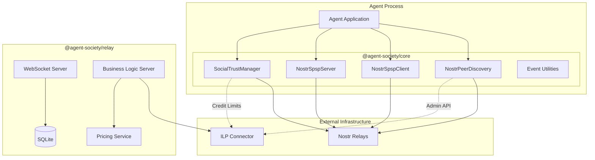

# 2. High Level Architecture

## 2.1 Technical Summary

Agent Society Protocol is a **TypeScript library** following a **modular monorepo architecture**. The system consists of three packages that enable autonomous agents to discover ILP payment peers via Nostr social graphs, exchange SPSP parameters over Nostr events, and compute trust-based credit limits from social relationships.

The architecture separates concerns cleanly: Nostr handles discovery and configuration, while ILP connectors handle actual packet routing. The library acts as a bridge—populating ILP connector routing tables from Nostr social graph data rather than replacing ILP infrastructure.

## 2.2 High Level Overview

1. **Architectural Style:** Library/SDK with modular package structure
2. **Repository Structure:** Monorepo with `@agent-society/core`, `@agent-society/relay`, `@agent-society/examples`
3. **Service Architecture:** Library consumed by agents (not a standalone service)
4. **Integration Patterns:**
   - Separate Processes: Library in agent process ↔ connector via Admin API
   - Embedded: Library embedded directly in custom connector implementations

## 2.3 High Level Project Diagram

## 2.4 Architectural and Design Patterns

| Pattern | Application | Rationale |
|---------|-------------|-----------|
| **Modular Monorepo** | Package organization | Simplifies dependency management; enables atomic changes |
| **Event-Driven Architecture** | Nostr pub/sub for discovery and SPSP | Natural fit for Nostr; enables real-time updates |
| **Strategy Pattern** | Configurable trust calculation | Agents can tune trust weights without code changes |
| **Builder Pattern** | Event builder utilities | Ensures correct event structure and signing |
| **Repository Pattern** | Event parsers | Clean separation between raw events and domain objects |
| **Business Logic Server (BLS)** | Relay payment verification | Standard ILP STREAM integration pattern |

---
