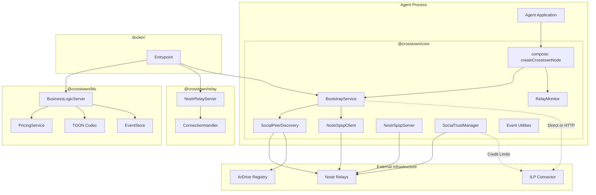

# 2. High Level Architecture

## 2.1 Technical Summary

Crosstown Protocol is a **TypeScript monorepo** with a **modular package architecture**. The system consists of five packages plus a Docker entrypoint that enable autonomous agents to discover ILP payment peers via Nostr social graphs, exchange SPSP parameters with settlement negotiation over Nostr events, compute trust-based credit limits from social relationships, and run as autonomous LLM-powered agents that process Nostr events in real-time.

The architecture separates concerns across four layers:
1. **Discovery & Configuration** — Nostr handles peer discovery, SPSP exchange, and social graph traversal
2. **Payment Routing** — ILP connectors handle actual packet routing, settlement, and payment channels
3. **Autonomous Decision-Making** — LLM-powered handlers process Nostr events and execute structured actions (planned, Epic 11)
4. **Cross-Town Collaboration** — NIP-34 decentralized git, NIP-29 project/federation groups, trust-weighted merge authority, DVM work dispatch (planned, Epics 12-17)

The library acts as a bridge — populating ILP connector routing tables from Nostr social graph data. In embedded mode (`createCrosstownNode()`), the connector runs in-process with zero-latency function calls.

**Gas Town Integration:** Gas Town instances (Go) participate as standard protocol peers. A Gas Town node subscribes to a Crosstown peer's Nostr relay (NIP-01 WebSocket) to receive events and track network activity, and submits ILP packets to that peer's connector (BTP/HTTP). No custom bridge protocol is required — Gas Town speaks the same protocols as any other peer. See the [Crosstown x Gas Town Integration Analysis](../research/gastown-integration-analysis.md) for detailed design.

## 2.2 High Level Overview

1. **Architectural Style:** Library/SDK with modular package structure + autonomous agent runtime
2. **Repository Structure:** Monorepo with `@crosstown/core`, `@crosstown/bls`, `@crosstown/relay`, `@crosstown/examples`, `@crosstown/ui-prototypes`, plus `docker/` entrypoint
3. **Service Architecture:** Library consumed by agents, with optional embedded connector mode and standalone Docker deployment
4. **Integration Patterns:**
   - **Embedded Mode:** `createCrosstownNode()` wires ConnectorNode + BLS + Bootstrap + RelayMonitor in-process (zero-latency)
   - **HTTP Mode:** Library in agent process communicates with connector via Admin API (separate processes)
   - **Docker Mode:** Standalone container running BLS + relay + bootstrap as a service
   - **Peer Mode (Gas Town):** External process (any language) subscribes to a Crosstown peer's Nostr relay and submits ILP packets to that peer's connector via standard protocols

## 2.3 High Level Project Diagram

## 2.4 Architectural and Design Patterns

| Pattern | Application | Rationale |
|---------|-------------|-----------|
| **Modular Monorepo** | Package organization (core, bls, relay, examples, ui-prototypes) | Simplifies dependency management; enables atomic changes across packages |
| **Event-Driven Architecture** | Nostr pub/sub for discovery, SPSP, and real-time monitoring | Natural fit for Nostr; enables real-time updates via RelayMonitor |
| **Composition Pattern** | `createCrosstownNode()` wires all components with start/stop lifecycle | Single entry point for embedded mode; avoids manual component wiring |
| **Interface Abstraction** | `AgentRuntimeClient` / `ConnectorAdminClient` with HTTP and direct implementations | Swap between embedded and HTTP mode without changing consumer code |
| **Layered Peer Discovery** | Genesis peers → ArDrive registry → NIP-02 social graph | Progressive fallback ensures bootstrap works even with minimal network |
| **Strategy Pattern** | Configurable trust calculation weights | Agents can tune trust weights without code changes |
| **Builder Pattern** | Event builder utilities for all Nostr event kinds | Ensures correct event structure, tagging, and signing |
| **Deterministic Event Routing** | Kind number → handler dispatch (not LLM classification) | Predictable, testable routing; LLM decides actions within handlers |
| **Business Logic Server (BLS)** | Payment verification and TOON-encoded event processing | Standard ILP integration pattern; extracted as reusable package |
| **State Machine** | Bootstrap phases: discovering → registering → handshaking → announcing → ready | Clear lifecycle with event-driven phase transitions |
| **Peering Gate** | NIP-02 follow + SPSP handshake required before any cross-Town interaction | Social graph is the access control layer; eliminates spam, sybil attacks, free-riding |
| **Trust-Weighted Consensus** | Merge authority emerges from trust-weighted approval set (planned, Epic 15) | No single point of failure; any qualified Town can merge |
| **Hybrid Local+Remote** | Co-located agents use local IPC; remote agents use Nostr/ILP | Preserves sub-millisecond local performance while enabling cross-machine coordination |

---
