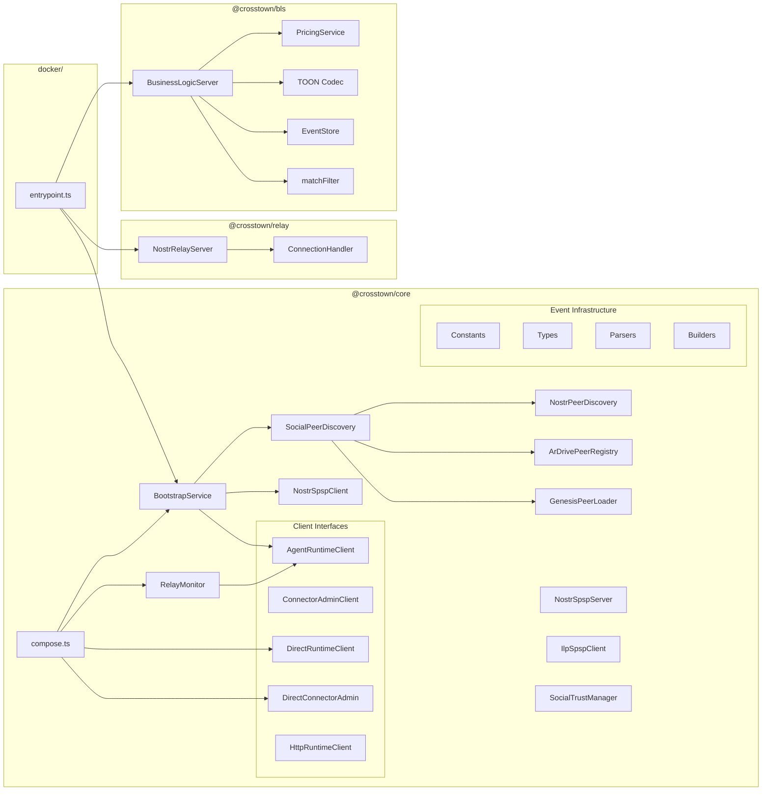

# 5. Components

## 5.1 @crosstown/core

**Responsibility:** Main protocol library providing peer discovery, SPSP exchange, trust calculation, bootstrap orchestration, and embedded connector composition.

**Key Modules:**
- `bootstrap/` - BootstrapService (multi-phase lifecycle), RelayMonitor (real-time kind:10032 monitoring), AgentRuntimeClient/ConnectorAdminClient interfaces, direct and HTTP client implementations
- `discovery/` - SocialPeerDiscovery (layered: genesis -> ArDrive -> NIP-02), NostrPeerDiscovery, ArDrivePeerRegistry, GenesisPeerLoader
- `spsp/` - NostrSpspClient, NostrSpspServer, IlpSpspClient (ILP-first SPSP), settlement negotiation, channel opening
- `trust/` - SocialTrustManager, creditLimit mapping
- `events/` - Parsers, builders, constants for all event kinds
- `compose.ts` - `createCrosstownNode()` composition function

**Dependencies:** nostr-tools

## 5.2 @crosstown/bls

**Responsibility:** Standalone Business Logic Server for ILP payment verification, TOON decoding, event pricing, and storage. Extracted from relay as a reusable package for both relay and Docker deployments.

**Key Modules:**
- `bls/` - BusinessLogicServer (handlePacket), types (HandlePacketRequest/Response)
- `pricing/` - PricingService (per-kind pricing), config loading (env vars, file-based)
- `storage/` - EventStore interface, InMemoryEventStore, SqliteEventStore
- `filters/` - NIP-01 filter matching (matchFilter)
- `toon/` - TOON encoder/decoder for Nostr event <-> ILP packet data

**Dependencies:** better-sqlite3, Hono, @toon-format/toon

## 5.3 @crosstown/relay

**Responsibility:** Reference implementation of ILP-gated Nostr relay with NIP-01 WebSocket server.

**Key Modules:**
- `websocket/` - NostrRelayServer, ConnectionHandler (NIP-01 REQ/EVENT/CLOSE)
- `bls/` - BusinessLogicServer (relay-specific BLS wrapping)
- `pricing/` - PricingService (relay pricing config)
- `storage/` - InMemoryEventStore, SqliteEventStore
- `toon/` - TOON encoder/decoder
- `filters/` - NIP-01 filter matching

**Dependencies:** ws, better-sqlite3, Hono

## 5.4 @crosstown/examples

**Responsibility:** Integration examples demonstrating library usage.

**Key Interfaces:**
- `ilp-gated-relay-demo/` - Full relay demo with agent, relay, and mock connector

**Dependencies:** @crosstown/core, @crosstown/bls

## 5.5 @crosstown/ui-prototypes

**Responsibility:** React-based UI prototypes for visualizing the agent network. Design exploration, not production code.

**Key Structure:**
- 9 prototypes in 3 categories: Observatory (network visualization), Colony (management), Nostr Client (social)
- Shared components in `src/components/shared/`
- Mock data layer with 12 agents, follow graph, trust scores, event feeds

**Dependencies:** React 19, Vite 7, Tailwind CSS v4, shadcn/ui, Radix UI

## 5.6 docker/

**Responsibility:** Standalone Docker entrypoint that wires BLS + relay + bootstrap into a deployable container.

**Key Files:**
- `src/entrypoint.ts` - Main entrypoint: config loading, BLS server start, SPSP server start, bootstrap orchestration
- `Dockerfile` - Container build

**Dependencies:** @crosstown/core, @crosstown/bls, @crosstown/relay

## 5.7 packages/agent/ (Planned -- Epic 11)

**Responsibility:** Autonomous TypeScript runtime using Vercel AI SDK (v6) that subscribes to Nostr relays, routes events by kind to LLM-powered handlers, and executes structured actions back to relays.

**Planned Modules:**
- Kind Registry + Handler Loader (markdown handler references -> system prompts)
- Zod action schemas with per-kind allowlists
- Core handler function (`handleNostrEvent()`) with structured output
- Action Executor (action JSON -> relay publish)
- Security defense stack (content isolation, datamarkers, rate limiting, audit log)
- Multi-model provider registry (Anthropic, OpenAI, Ollama)

**Planned Dependencies:** ai (Vercel AI SDK v6), @ai-sdk/anthropic, zod, nostr-tools

## 5.8 Gas Town Peer Integration (Planned -- Epics 12-17)

**Architecture:** Gas Town instances (Go, ~189K LOC) participate as standard protocol peers. No new Crosstown package is required — the existing relay, BLS, and connector serve Gas Town nodes via standard protocols.

**Integration Surface:**
- **Nostr relay** — Gas Town subscribes via NIP-01 WebSocket; publishes kind:30078 (work dispatch), kind:30080 (completion), kind:14 (DMs), NIP-90 DVM jobs
- **ILP connector** — Gas Town submits PREPARE/FULFILL packets via BTP/HTTP for cross-Town payment
- **NIP handler** — `packages/agent/` processes Gas Town event kinds through the standard kind registry (new handler references for kind:30078, 30080, 30081)

**Planned Crosstown Additions (across Epics 12-17):**
- `PrivateMessaging` — NIP-17 three-layer encryption for cross-Town mail (Epic 12)
- `RemoteSignerDaemon` — NIP-46 scoped signing for Polecat key isolation (Epic 12)
- `DvmJobHandler` — NIP-90 DVM processing with ILP payment flow (Epic 13)
- `CrossTownReviewAggregator` — NIP-32 label aggregation with trust-weighted threshold (Epic 15)
- `MergeAuthoritySelector` — Trust-weighted merge authority for NIP-34 patches (Epic 15)
- `FederationManager` — NIP-29 federation group lifecycle (Epic 17)
- `FederationAddressManager` — Hierarchical ILP addressing `g.<town>.<rig>.<agent>` (Epic 17)

## 5.9 Component Diagram

---
