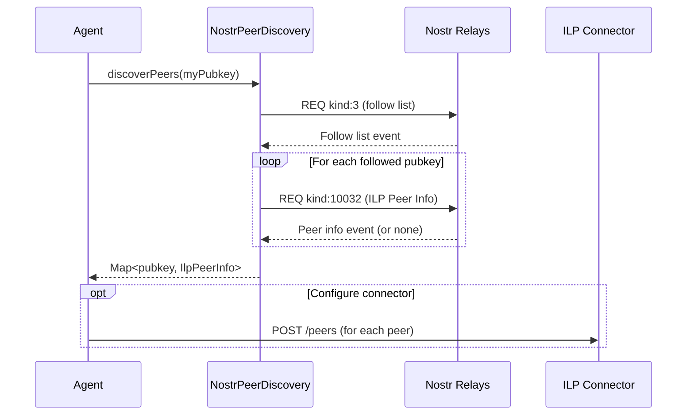
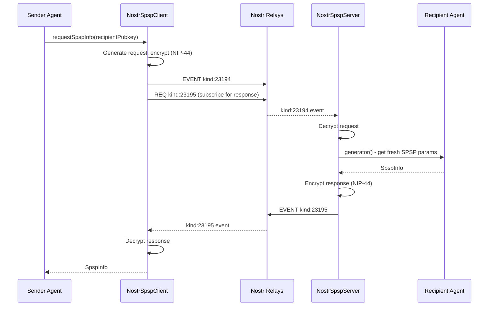
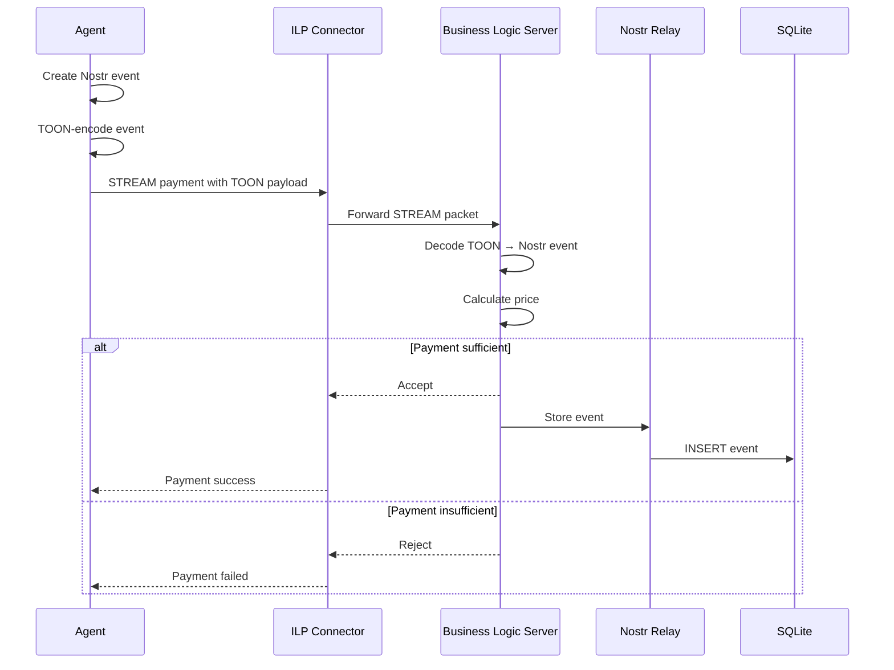

# 7. Core Workflows

## 7.1 Peer Discovery Flow

```mermaid
sequenceDiagram
    participant Agent
    participant NPD as NostrPeerDiscovery
    participant Relay as Nostr Relays
    participant Connector as ILP Connector

    Agent->>NPD: discoverPeers(myPubkey)
    NPD->>Relay: REQ kind:3 (follow list)
    Relay-->>NPD: Follow list event

    loop For each followed pubkey
        NPD->>Relay: REQ kind:10032 (ILP Peer Info)
        Relay-->>NPD: Peer info event (or none)
    end

    NPD-->>Agent: Map<pubkey, IlpPeerInfo>

    opt Configure connector
        Agent->>Connector: POST /peers (for each peer)
    end
```

## 7.2 Dynamic SPSP Handshake

```mermaid
sequenceDiagram
    participant Sender as Sender Agent
    participant NSC as NostrSpspClient
    participant Relay as Nostr Relays
    participant NSS as NostrSpspServer
    participant Recipient as Recipient Agent

    Sender->>NSC: requestSpspInfo(recipientPubkey)
    NSC->>NSC: Generate request, encrypt (NIP-44)
    NSC->>Relay: EVENT kind:23194
    NSC->>Relay: REQ kind:23195 (subscribe for response)

    Relay-->>NSS: kind:23194 event
    NSS->>NSS: Decrypt request
    NSS->>Recipient: generator() - get fresh SPSP params
    Recipient-->>NSS: SpspInfo
    NSS->>NSS: Encrypt response (NIP-44)
    NSS->>Relay: EVENT kind:23195

    Relay-->>NSC: kind:23195 event
    NSC->>NSC: Decrypt response
    NSC-->>Sender: SpspInfo
```

## 7.3 ILP-Gated Relay Write Flow

```mermaid
sequenceDiagram
    participant Agent
    participant Connector as ILP Connector
    participant BLS as Business Logic Server
    participant Relay as Nostr Relay
    participant DB as SQLite

    Agent->>Agent: Create Nostr event
    Agent->>Agent: TOON-encode event
    Agent->>Connector: STREAM payment with TOON payload
    Connector->>BLS: Forward STREAM packet

    BLS->>BLS: Decode TOON → Nostr event
    BLS->>BLS: Calculate price

    alt Payment sufficient
        BLS-->>Connector: Accept
        BLS->>Relay: Store event
        Relay->>DB: INSERT event
        Connector-->>Agent: Payment success
    else Payment insufficient
        BLS-->>Connector: Reject
        Connector-->>Agent: Payment failed
    end
```

---
