# 7. Core Workflows

## 7.1 Layered Peer Discovery Flow

## 7.2 SPSP Handshake with Settlement Negotiation

## 7.3 ILP-Gated Relay Write Flow

## 7.4 Network Bootstrap Flow

## 7.5 Embedded Connector Composition

## 7.6 Cross-Town DVM Work Dispatch (Planned -- Epics 12-13)

## 7.7 Cross-Town NIP-34 Patch Merge (Planned -- Epic 15)

```mermaid
sequenceDiagram
    participant TownA as Town A (Contributing)
    participant Relay as Nostr Relay
    participant TownB as Town B (Reviewer)
    participant TownC as Town C (Reviewer)
    participant MA as Merge Authority

    Note over TownA: Refinery merges to integration branch
    TownA->>Relay: EVENT kind:1617 (NIP-34 patch)

    Relay-->>TownB: kind:1617 subscription match
    Relay-->>TownC: kind:1617 subscription match

    TownB->>TownB: Review patch
    TownB->>Relay: EVENT kind:1985 (NIP-32 label: "approved")

    TownC->>TownC: Run CI via DVM
    TownC->>Relay: EVENT kind:1985 (NIP-32 label: "tests-passing")
    TownC->>Relay: EVENT kind:1985 (NIP-32 label: "approved")

    Note over MA: Σ trust(approvers) >= threshold
    MA->>MA: Select merge authority (highest trust with push access)
    MA->>MA: Apply patch to shared remote
    MA->>Relay: EVENT kind:1631 (NIP-34 status: merged)

    Relay-->>TownA: kind:1631 (merged confirmation)
    Note over TownA: ILP FULFILL sent to contributing Town
```

---
